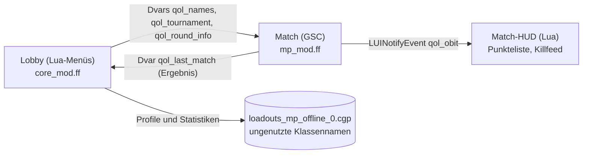

# BO3 Splitscreen QoL

Offline-Mod für **Call of Duty: Black Ops III (PC, Steam)**, die lokalen Splitscreen am Laptop oder PC deutlich
angenehmer macht: feste Controller-Zuordnung für beide Spieler, geteilter Bildschirm im Klasseneditor, Klassen
kopieren, lokale Spielerprofile mit Statistiken, eine lokale Bestenliste und Turniere – auch über LAN.

Die Mod besteht nur aus Mod-Dateien (Lua-Menüs + GSC-Spielskript), die über das normale **Mods**-Menü von BO3
geladen werden. Keine DLLs, keine Zusatzprogramme, keine Mod Tools auf dem Spiel-PC.

Technische Dokumentation für Mitentwickler: **[HOW_IT_WORKS.md](HOW_IT_WORKS.md)**.

> **English summary** – Offline quality-of-life mod for Black Ops III local splitscreen on PC: fixed controller
> assignment for both players (keyboard always stays with player 1), a splitscreen toggle in the lobby list,
> side-by-side class editor / specialists / scorestreaks for both players at once, class copying between players,
> local profiles with stats and head-to-head records, a local leaderboard, tournaments (teams or free-for-all, also
> with LAN players) and profile names in the party list, scoreboard and killfeed. Pure mod files (Lua UI + GSC), loaded
> from the in-game Mods menu. The in-game texts are German.

---

## Inhalt

- [Status](#status)
- [Funktionen](#funktionen)
- [Installation](#installation)
- [Schnellstart](#schnellstart)
- [Bedienung im Detail](#bedienung-im-detail)
- [Wie es funktioniert](#wie-es-funktioniert)
- [Grenzen und bekannte Einschränkungen](#grenzen-und-bekannte-einschränkungen)
- [Fehlersuche](#fehlersuche)
- [Selbst bauen](#selbst-bauen)
- [Im Steam Workshop veröffentlichen](#im-steam-workshop-veröffentlichen)
- [Projektstruktur](#projektstruktur)
- [Mitentwickeln](#mitentwickeln)
- [Credits](#credits)

## Status

Version **0.7.0** (September 2026). ✅ = im Spiel mit echten Controllern getestet, 🧪 = gebaut und automatisch
geprüft, im Spiel aber noch nicht bestätigt. Die Grundfunktionen laufen, die neueren Teile brauchen noch Praxistests -
deshalb noch keine 1.0.

| Funktion | Status |
| --- | --- |
| Mod lädt offline, Einträge in der Lobby-Liste | ✅ |
| SPLITSCREEN AKTIVIEREN/DEAKTIVIEREN in der linken Lobby-Liste | ✅ |
| Eingabegerät Spieler 1 und 2 wählen, Controller tauschen | ✅ |
| Spieler-2-Karte (Klasseneditor, Spezialisten, Punkteserien mit dem eigenen Controller) | ✅ |
| Geteilter Bildschirm: beide Spieler gleichzeitig im Klasseneditor | ✅ |
| Controller-Kabel ziehen/wieder einstecken während des geteilten Menüs | ✅ |
| Lokale Profile „WER SPIELT?“ anlegen und wählen | ✅ |
| Profile bleiben nach Neustart erhalten, Profilnamen beim Start in der Party-Liste | ✅ |
| Profil nicht doppelt wählbar, Party-Namen auch nach Profilwechsel | 🧪 |
| Turnier anlegen und erste Runde direkt starten | ✅ |
| Eingabegerät Spieler 1 bleibt nach Neustart gespeichert | 🧪 |
| Klassen kopieren (eine oder alle Klassen) mit Bild-Vorschau | 🧪 |
| „WER SPIELT?“ getrennt in beiden Bildschirmhälften | 🧪 |
| Statistiken und Duelle nach einem Match, lokale Bestenliste mit Werten | 🧪 |
| Turnierwertung, nächste Runde, Sieger, Teamzuteilung | 🧪 |
| Turnier-Regeln je Runde (Spiel einrichten, Bots), Beschränkungen wie „Nur Scharfschützengewehre“ | 🧪 |
| Turniervorlagen speichern, Kartenbilder, Vorlagen-Datei (Export/Import) | 🧪 |
| Namen im Match (Punkteliste und Killfeed) | 🧪 |
| Profile umbenennen/zurücksetzen/löschen, Speicheranzeige | 🧪 |
| Mausbedienung in allen Mod-Menüs | 🧪 |
| Anpassung des geteilten Bildschirms bei geänderter Fenstergröße | 🧪 |
| LAN mit zwei Rechnern (z. B. 2 + 2 Spieler) | 🧪 |

Rückmeldungen zu den 🧪-Punkten sind willkommen (Issue mit Screenshot der Statuszeile, siehe [Fehlersuche](#fehlersuche)).

## Funktionen

**Splitscreen und Eingabe**
- Eintrag **SPLITSCREEN AKTIVIEREN** in der linken Lobby-Liste unter CODCASTER – mit Steuerkreuz erreichbar,
  nicht nur mit der Maus.
- Neue Einstellung **Eingabegerät Spieler 1** direkt über „Eingabegerät Spieler 2“: *Automatisch*, *Nur
  Tastatur/Maus* oder ein bestimmter Controller. Wählt ein Spieler den Controller des anderen, wird getauscht.
- Die Tastatur bleibt für Spieler 1 immer zusätzlich aktiv (z. B. wenn ein Controller die Verbindung verliert).
- Ein Wächter im Hintergrund stellt die gewählte Zuordnung wieder her, wenn BO3 sie verliert (Controller neu
  verbunden, Spieler 2 tritt bei).

**Menüs**
- **Geteilter Bildschirm:** Öffnet einer der beiden Klasseneditor, Spezialisten oder Punkteserien, wird der
  Bildschirm senkrecht geteilt (links Spieler 1, rechts Spieler 2). Beide bedienen ihre Hälfte gleichzeitig mit
  dem eigenen Controller. Die Hälften passen sich an Seitenverhältnis und Fenstergröße an.
- **Spieler-2-Karte** rechts in der Lobby: Spieler 2 öffnet seine Menüs mit dem eigenen Controller.
- **Klassen kopieren:** eine oder alle Klassen von Spieler 1 zu Spieler 2 oder umgekehrt, mit Bild-Vorschau beider
  Klassen (Waffen, Aufsätze, Ausrüstung, Extras, Wildcards) und Sicherheitsabfrage.
- Alle Mod-Menüs lassen sich mit Controller, Tastatur **und Maus** bedienen.

**Profile, Statistiken, Turniere**
- **WER SPIELT?** erscheint, sobald Spieler 2 beitritt – im geteilten Bildschirm, jede Hälfte für sich: Wer gewählt
  hat, kann sofort Klassen bearbeiten, während der andere noch seinen Namen eintippt. Ein Profil kann nicht von
  beiden gleichzeitig gewählt werden.
- **Statistiken je Profil:** Spiele, Siege, Kills, Tode, K/D, Kopfschüsse und Duelle („Anna gegen Ben: 12 Kills /
  4 Tode“).
- **LOKALE BESTENLISTE** mit Sortierung und Profilverwaltung (umbenennen, Statistik zurücksetzen, löschen).
- **Profilnamen** statt Steam-Namen in der Party-Liste, in der Punkteliste im Match und in einem eigenen Killfeed.
- **TURNIER** für alle Spieler der Lobby, auch von anderen Rechnern im LAN:
  - *Teams – Best of 3* oder *Best of 5* (2 Teams beliebiger Größe: 1v1, 2v2 … bis zur Lobby-Grenze),
  - *Jeder gegen jeden – Punkte* (3 Runden, Platzierungspunkte),
  - Modus und Karte je Runde frei wählbar (mit Kartenbild), Anzeigenamen je Spieler, Runde startet direkt,
  - **Spielregeln** wie unter „Spiel einrichten“ (Zeit- und Punktelimit, Radar, Hardcore, nur Kopfschüsse, Spawn,
    Gesundheit …), **Bots** und **Beschränkungen** („Nur Scharfschützengewehre“, „Nur Schrotflinten“, „Ohne
    Punkteserien“ …) – für alle Runden gleich oder je Runde, auf andere Runden kopierbar,
  - **Turniervorlagen**: eingebaute und eigene Vorlagen mit Format, Modi, Karten und Regeln; als Datei exportier-
    und importierbar (Backup, anderer Rechner),
  - nach jedem Match Wertung, Tabelle und automatisch die nächste Runde; Unentschieden wird wiederholt.

## Installation

Voraussetzung: Black Ops III für PC (Steam). Für zwei Spieler zwei Controller oder Tastatur + Controller.

### Über den Steam Workshop

1. Die Mod im Steam Workshop von Black Ops III abonnieren.
2. BO3 starten → **MODS** → *BO3 Splitscreen QoL* → **Laden**.

### Manuell (ZIP)

1. `bo3_splitscreen_qol-<version>.zip` herunterladen - unter *Releases* oder aus dem Ordner
   [release/](release/) dieses Projekts.
2. In den Mods-Ordner des Spiels entpacken, sodass diese Struktur entsteht:

   ```text
   ...\steamapps\common\Call of Duty Black Ops III\mods\bo3_splitscreen_qol\zone\core_mod.ff
                                                                            \mp_mod.ff
                                                                            \en_core_mod.ff  en_mp_mod.ff
                                                                            \ge_core_mod.ff  ge_mp_mod.ff
   ```

3. BO3 starten → **MODS** → `bo3_splitscreen_qol` → **Laden**.

Die Mod legt ihre eigenen Spielstände an (`players\mods\bo3_splitscreen_qol\`). Klassen und Statistiken des
normalen Spiels bleiben unberührt; beim ersten Start mit Mod gelten die Standardklassen.

> **Nicht mit geladener Mod online gehen.** BO3 erlaubt Mods nur offline bzw. im LAN; der Online-Bereich
> deaktiviert die Mod wieder.

## Schnellstart

1. **MODS** → Mod laden → **MEHRSPIELER** → offline/LAN spielen → **EIGENES SPIEL** (oder LAN-Spiel).
2. In der linken Liste unter CODCASTER **SPLITSCREEN AKTIVIEREN** wählen; Spieler 2 drückt eine Taste auf seinem
   Controller und meldet sich an.
3. **WER SPIELT?** erscheint geteilt: Jeder wählt in seiner Hälfte mit seinem Controller ein Profil (oder
   `+ NEUES PROFIL`, Namen tippt man auf der PC-Tastatur). Haben beide gewählt, schließt sich der geteilte Bildschirm.
4. Falls die Controller vertauscht sind: **Einstellungen → Steuerung → Gamepad → Splitscreen** →
   *Eingabegerät Spieler 1* / *Eingabegerät Spieler 2*.
5. Klassen bearbeiten: Einer öffnet den Klasseneditor → der Bildschirm teilt sich → beide wählen **FERTIG**.
6. Spiel starten wie gewohnt. Nach dem Match stehen Statistiken in **LOKALE BESTENLISTE**.

## Bedienung im Detail

Tastatur und Maus steuern immer Spieler 1. In allen Mod-Menüs gilt:

| Aktion | Controller | Tastatur | Maus |
| --- | --- | --- | --- |
| Zeile wählen | Steuerkreuz hoch/runter | Pfeiltasten | Zeile anklicken |
| Wert ändern | Steuerkreuz links/rechts | Pfeiltasten | Linksklick vor, Rechtsklick zurück |
| Ausführen | A / Kreuz | Enter | Linksklick |
| Name eingeben (Turnier) | X / Quadrat | Leertaste | – |
| Zurück / fertig | B / Kreis | Esc | `[ ZURÜCK ]` / `[ FERTIG ]` |

### Lobby-Liste (links, unter CODCASTER)

| Eintrag | Wer | Zweck |
| --- | --- | --- |
| SPLITSCREEN AKTIVIEREN/DEAKTIVIEREN | Host | Spieler 2 hinzufügen/entfernen |
| LOKALE PROFILE | alle | „WER SPIELT?“ erneut öffnen (geteilt, wenn Spieler 2 da ist) |
| KLASSEN KOPIEREN | alle | Klassen zwischen den beiden lokalen Spielern kopieren |
| LOKALE BESTENLISTE | alle | Statistiken, Duelle, Profile verwalten |
| TURNIER | Host | Turnier einrichten, Stand ansehen, Runde starten |

Die Einträge erscheinen in **Eigenes Spiel** und in LAN-Lobbys. Im Offline-Hauptmenü gibt es zusätzlich
SPLITSCREEN AKTIVIEREN, damit ein zweiter Rechner schon vor dem LAN-Beitritt zu zweit ist.

### Geteilter Bildschirm

- Wird automatisch benutzt, sobald Spieler 2 angemeldet ist und einer der beiden **KLASSENEDITOR**,
  **SPEZIALISTEN** oder **PUNKTESERIEN** öffnet (über die Lobby-Liste oder die Spieler-2-Karte).
- Jede Hälfte hat ein eigenes Menü: PROFIL · KLASSENEDITOR · SPEZIALISTEN · PUNKTESERIEN · KLASSEN KOPIEREN · FERTIG.
- Der geteilte Bildschirm schließt sich, wenn **beide** FERTIG gewählt haben (B/Esc im Hälften-Menü).
- Verliert ein Controller die Verbindung, bleibt alles offen und die Hälfte zeigt einen Hinweis. Erst wenn Spieler 2
  zehn Sekunden lang abgemeldet ist, wird gespeichert und geschlossen.

### Klassen kopieren

Zeilen: **Umfang** (eine Klasse / alle Klassen) · **Von** (Spieler) · **Klasse** · **Nach** (Spieler) · **Klasse** ·
**KOPIEREN**. Darunter zeigen zwei Vorschauen die Quellklasse (VON) und die Klasse, die überschrieben wird (NACH), mit
Bildern und Namen; bei „Alle Klassen“ eine Liste aller Klassen. Vor dem Überschreiben kommt eine Sicherheitsabfrage. Kopiert werden Waffen, Aufsätze, Extras,
Wildcards, Ausrüstung, Tarnungen/Lackierungen und der Klassenname. Spezialist und Punkteserien gehören nicht zur
Klasse und werden nicht kopiert.

### Profile und Bestenliste

- **WER SPIELT?** öffnet sich 1,5 Sekunden nachdem Spieler 2 beigetreten ist, im geteilten Bildschirm. Links wählt
  Spieler 1, rechts Spieler 2 – jeweils mit dem eigenen Controller. Wer gewählt hat, sieht sein Hälften-Menü und kann
  z. B. schon den Klasseneditor öffnen. `OHNE PROFIL` spielt unter dem Steam-Namen. Über **PROFIL** im Hälften-Menü
  oder **PROFIL WÄHLEN** auf der Spieler-2-Karte lässt sich das Profil später ändern.
- In der **LOKALEN BESTENLISTE** mit links/rechts sortieren (Siege, K/D, Kills, Kopfschüsse, Spiele). A/Enter oder
  Klick auf ein Profil öffnet UMBENENNEN, STATISTIK ZURÜCKSETZEN, PROFIL LÖSCHEN.
- Oben rechts zeigt die Bestenliste, wie voll der Profilspeicher ist (siehe [Grenzen](#grenzen-und-bekannte-einschränkungen)).
- Gezählt werden Matches, die dieser Rechner hostet und in denen der Spieler ein Profil gewählt hat. Ein Sieg zählt,
  wenn das eigene Team (bzw. im Jeder-gegen-jeden der Spieler) allein vorne liegt.

### Turnier

1. **TURNIER** (Host) → oben eine **VORLAGE** wählen und mit A/Enter laden – oder **Format** selbst einstellen.
2. **Regeln:** *Für alle Runden gleich* oder *Je Runde einzeln*.
3. Für jede Runde **Modus** und **Karte** einstellen; rechts erscheinen Kartenbild, Modus und Regeln der Runde.
4. **REGELN** öffnen: Alle Einstellungen aus „Spiel einrichten“ für die gewählten Modi, dazu Bots und Beschränkungen.
   Links/rechts ändert einen Wert (grün = geändert, *Standard* = Voreinstellung des Modus). Schnellwahlen setzen
   feste Modi wie „Nur Scharfschützengewehre“; verbotene Gegenstände lassen sich im Klasseneditor nicht ausrüsten,
   also baut sich jeder eine passende Klasse. Im Modus *Je Runde* gibt es **DIESE REGELN FÜR ALLE RUNDEN
   ÜBERNEHMEN** und **REGELN VON RUNDE n ÜBERNEHMEN**.
5. **TEAMS EINTEILEN**: alle Spieler der Lobby (auch von anderen Rechnern). Links/rechts wechselt das Team,
   X/Leertaste vergibt einen Anzeigenamen (wird in Party-Liste, Punkteliste und Killfeed benutzt),
   **LOBBY NEU EINLESEN** übernimmt neu beigetretene Spieler.
6. **ALS VORLAGE SPEICHERN** (optional): Format, Runden, Karten und Regeln unter einem Namen sichern.
7. **TURNIER STARTEN** lädt Runde 1 (Modus, Karte, Regeln, Teams) und startet das Match sofort.
8. Nach dem Match öffnet sich die Tabelle, die nächste Runde ist schon eingestellt → **RUNDE n STARTEN**.

Eingebaute Vorlagen: *Klassiker*, *Scharfschützen*, *Nur Kopfschüsse*, *Hardcore*, *Schrotflinten*, *Jeder gegen jeden*.
Karten, die eine Vorlage nicht festlegt, werden automatisch verteilt.

**Vorlagen-Datei** (TURNIER → VORLAGEN-DATEI): BO3 darf keine Dateien schreiben, deshalb läuft der Export über das
Konsolenprotokoll.
- *Exportieren* schreibt alle eigenen Vorlagen als fertige Befehlszeilen in `console_mp.log` im Mod-Ordner
  (Pfad steht im Menü). Den Block zwischen den `=====`-Zeilen in eine Textdatei `qol_turniere.cfg` kopieren.
- *Laden* liest `qol_turniere.cfg` (Speicherort: siehe Menü; auf dem Entwicklungsrechner wird er gerade getestet)
  und übernimmt alle Vorlagen – gleiche Namen werden ersetzt.
- *Code einfügen*: den Vorlagen-Code (beginnt mit `T1~`) direkt in das Textfeld einfügen.

Wertung:
- *Teams:* Rundensieger ist das Team mit mehr Punkten (Team-Punktestand von BO3, sonst die Summe der
  persönlichen Punkte). Gleichstand → die Runde wird wiederholt. Wer zuerst 2 (Best of 3) bzw. 3 (Best of 5)
  Runden gewinnt, gewinnt das Turnier.
- *Jeder gegen jeden:* pro Runde bekommt der Letzte 1 Punkt, jeder Platz darüber einen mehr. Nach 3 Runden gewinnt
  der Spieler mit den meisten Punkten.
- Ein Match ohne Turnierspieler (z. B. vor dem Anlegen gespielt) wird nicht gewertet.
- Beim Spawnen zeigt das Match einen Hinweis „TURNIER Runde x/y: TEAM A (…) vs TEAM B (…)“ mit den Regeln.

### LAN mit mehreren Rechnern

Beispiel: 4 Spieler an 2 Rechnern, je 2 im Splitscreen.

1. **Beide Rechner** laden dieselbe Version der Mod (bei Workshop: beide abonnieren) und sind im selben Netzwerk.
2. Rechner 1 (Host) öffnet eine LAN-Lobby und aktiviert dort den Splitscreen.
3. Rechner 2 wählt im Offline-Mehrspieler-Hauptmenü **SPLITSCREEN AKTIVIEREN** (beide Spieler anmelden) und tritt
   danach über **LAN-SPIEL SUCHEN** bei.
4. Der Host richtet über **TURNIER** z. B. 2v2 ein und startet.

Rechner 2 hat eigene Profile und kann Klassen kopieren und die geteilten Menüs benutzen. Statistiken werden nur auf
dem Host gezählt (siehe Grenzen).

## Wie es funktioniert



**Einstieg ohne DLL.** BO3 lädt beim Start des Menüs eine Liste von Lua-Dateien
(`ui/uieditor/menus/core_frontend_patch_require.lua`). Die Mod liefert diese Datei mit der originalen Liste plus
`pcall(require, "ui.qol.main")` aus. Im Match gilt dasselbe für `core_patch_require.lua` → `ui.qol.ingame`. Jedes
Modul wird einzeln per `pcall` geladen; ein Fehler legt nie das Originalmenü lahm, sondern erscheint in der
Statuszeile.

**Eingriffe in die Originalmenüs** (alle als Wrapper um die Originalfunktion):

| Hook | Zweck |
| --- | --- |
| `CoD.LobbyMenus.AddButtonsForTarget` | zusätzliche Einträge in der Lobby-Liste |
| `LUI.createMenu.Lobby` | Spieler-2-Karte, Statuszeile, Datenstart, Auswertung nach dem Match |
| `CoD.Menu.HandleButtonPress` | Eingaben des Controllers von Spieler 2 für die Spieler-2-Karte abfangen |
| `DataSources.OptionGamepadSettingsPC.prepare` | Zeile „Eingabegerät Spieler 1“ und Tausch-Logik für Spieler 2 |
| `CoD.LobbyButtons.MP_CAC / MP_SPECIALISTS / MP_SCORESTREAKS` | Menüs im geteilten Bildschirm öffnen |
| `CoD.LobbyUtility.UpdateLobbyList` | Profilnamen in der Party-Liste |
| `GetClientNameAndClanTag`, `LUI.createMenu.T7Hud` | Namen in der Punkteliste, eigener Killfeed |

**Controller.** Die PC-Version hat eine Engine-API für die Zuordnung (`Engine.GamepadsConnectedMap/UnMap/Port/…`),
die auch die Originaloption für Spieler 2 benutzt. Die Mod baut damit die Option für Spieler 1, tauscht belegte
Controller und prüft jede Sekunde, ob die Zuordnung noch zur Einstellung passt.

**Geteilter Bildschirm.** Ein Overlay über der Lobby enthält zwei per Stencil beschnittene Hälften. In jeder Hälfte
liegt eine skalierte 1280×720-Fläche mit einem kleinen Menü, das dem Controller dieses Spielers gehört. Von dort
werden die Originalmenüs geöffnet. BO3 hängt neue Menüs an das Elternelement des öffnenden Menüs, deshalb bleibt die
ganze Menükette in ihrer Hälfte; und jedes Menü reagiert nur auf die Tasten seines Controllers. Die Skalierung
ergibt sich aus der echten Halbbreite (16:9, 16:10, 21:9, Fenster).

**Speichern ohne Dateizugriff.** Mods dürfen keine eigenen Dateien schreiben. Die Mod speichert deshalb einen kurzen
Text in den Klassennamen der Klassensätze für private und Liga-Online-Matches (`customMatchCacLoadouts`,
`leagueCacLoadouts`). Diese existieren in der Offline-Klassendatei, werden offline aber nie benutzt. BO3 schreibt sie
mit den normalen Klassen nach `players\mods\<mod>\loadouts_mp_offline_0.cgp`. Format:
`Q2|<Länge>|B<Starts>;P<id>,<Kills>,<Tode>,<Kopfschüsse>,<Spiele>,<Siege>,<Name>;V<id>,<id>,<Kills>;A<id S1>,<id S2>;I<Eingabe>`.

**Match-Auswertung.** `scripts/mp/gametypes/_clientids.gsc` (originale Datei + Ergänzungen) umhüllt
`level.callbackPlayerKilled`: Für jeden Kill geht ein `LUINotifyEvent` an das HUD (Killfeed), und Kills zwischen
Spielern werden gezählt. Bei `game_ended` schreibt das Skript ein Ergebnis mit Modus, Karte, Teampunkten und allen
Spielern in den Dvar `qol_last_match`. Zurück in der Lobby liest das Menü den Dvar, ordnet die Spieler den lokalen
Profilen zu, zählt Statistiken und Turnierwertung und speichert.

**Sitzungsdaten.** Dvars überleben den Wechsel Lobby ↔ Match, weil die Engine sie hält, während die Lua-Menüs neu
geladen werden. Darüber laufen Namenstabelle (`qol_names`), Turnierstand (`qol_tournament`) und Rundenhinweis. Beim
Beenden des Spiels sind sie weg; Profile und Statistiken liegen im Speicher oben.

**Absicherung.**
- Alle Hooks und Button-Aktionen laufen geschützt (`pcall`); Fehler erscheinen als „FEHLER: …“ in der Statuszeile.
- Ein **Selbsttest** prüft bei jedem Menüstart die reine Logik (Speicherformat, Namenstabelle, Match-Ergebnis,
  Turnierwertung inklusive Unentschieden und Jeder-gegen-jeden).
- Beim Bauen prüft `tools/lua_lint.py` alle Lua-Dateien mit einem vollständigen Lua-5.1-Parser auf Syntaxfehler und
  unbekannte oder neu angelegte globale Namen. BO3 verbietet neue Globals nach dem Menüstart; solche Fehler zeigen
  sich sonst erst im Spiel.

## Grenzen und bekannte Einschränkungen

- **Nur offline und LAN.** Mit Mod geht BO3 nicht online.
- **Profilspeicher ca. 300 Zeichen** – das reicht für etwa 4–6 Profile mit Duellen. Wird es eng, verwirft die Mod
  zuerst die Duelle mit den wenigsten Kills. Ist trotzdem kein Platz, wird ein neues Profil abgelehnt → alte Profile
  in der Bestenliste löschen.
- **Statistiken nur auf dem Host.** Das Match-Skript läuft auf dem Rechner, der das Spiel hostet. Profile auf einem
  beigetretenen LAN-Rechner bekommen keine Statistiken.
- **Namen anderer Rechner:** In der Party-Liste und im Match erscheinen Spieler anderer Rechner mit Steam-Namen, außer
  der Host vergibt im Turnier einen Anzeigenamen. Namen über den Köpfen der Spieler zeichnet die Engine; die lassen
  sich nicht ändern.
- **Killfeed:** Der eigene Killfeed erscheint, sobald Profil- oder Turniernamen aktiv sind, und blendet den
  originalen dann aus (im Splitscreen zeigt BO3 ohnehin keinen eigenen Killfeed).
- **Turnierstand** gilt nur, solange das Spiel läuft (nicht nach einem Neustart).
- **Turniervorlagen** liegen in einem zweiten, größeren Zusatzspeicher in ungenutzten Feldern derselben Klassendatei
  (einige Hundert Zeichen, reicht für mehrere Vorlagen). Ist er nicht verfügbar, gelten eigene Vorlagen nur bis zum
  Neustart – dann über die Vorlagen-Datei sichern.
- **Beschränkungen** nutzen die Gegenstands-Sperren der Engine. Ob BO3 sie in jedem Offline-Modus durchsetzt, ist
  noch nicht bestätigt.
- **Teamzuteilung im Turnier:** Die Mod setzt die Teams über die Host-Zuteilung von BO3. Ob BO3 sie in jedem Modus
  übernimmt, ist noch nicht bestätigt; die Wertung folgt den im Match tatsächlich gespielten Teams.
- **Spezialisten im geteilten Bildschirm:** Die 3D-Figur gibt es nur einmal, deshalb haben die Hälften einen dunklen
  Hintergrund.
- **Namen eingeben** geht über das Texteingabefeld von BO3, also praktisch über die PC-Tastatur.
- Die Menütexte der Mod sind Deutsch.

## Fehlersuche

| Problem | Lösung |
| --- | --- |
| Schwarzer Bildschirm nach „Laden“ | Beim ersten Laden einer Mod bis zu einer Minute warten. |
| „Could not find zone ge_mp_mod“ o. ä. | Installation unvollständig – alle sechs `.ff`-Dateien müssen im `zone`-Ordner liegen. |
| Einträge fehlen in der Lobby | Mod geladen? Nur in *Eigenes Spiel* und LAN-Lobbys sichtbar, TURNIER nur für den Host. |
| Controller vertauscht / Spieler 1 reagiert nicht | *Eingabegerät Spieler 1* fest auf einen Controller stellen; Tastatur funktioniert immer. |
| Oben erscheint „FEHLER: …“ | Screenshot der Zeile in einem Issue posten. |
| „Profile nicht gespeichert: Speicher voll“ | In LOKALE BESTENLISTE ungenutzte Profile löschen. |
| Mod plötzlich deaktiviert | Der Online-Bereich wurde geöffnet – Mod erneut laden und offline bleiben. |

Im Entwicklungs-Build (`bo3_qol_dev`) zeigt oben eine Statuszeile Version, Controller-Zuordnung, Speicherstatus und
Selbsttest. Das Konsolenprotokoll liegt dann unter `...\Call of Duty Black Ops III\mods\bo3_qol_dev\console_mp.log`.

## Selbst bauen

Nur für Entwickler; zum Spielen reicht das fertige Paket.

**Voraussetzungen**
- *Call of Duty: Black Ops III – Mod Tools* (Steam → Bibliothek → Tools).
- **L3akMod** (The D3V Team) in den Mod Tools installiert – die offiziellen Mod Tools können keine Lua-Menüs in Mods
  linken.
- Windows PowerShell 5.1; Python 3 (optional, für `tools/lua_lint.py`).
- In `build-dev.ps1` stehen die Pfade `$toolsRoot` (Mod Tools) und `$gameRoot` (Spiel) – bei anderer
  Steam-Bibliothek anpassen.

**Bauen**

```powershell
# Entwicklungs-Build "bo3_qol_dev" (Statuszeile, Konsolenlog), installiert ins Spiel (BO3 muss geschlossen sein)
powershell -NoProfile -ExecutionPolicy Bypass -File .\build-dev.ps1 -Install

# Release "bo3_splitscreen_qol": Statuszeile nur bei Fehlern, ZIP unter dist\
powershell -NoProfile -ExecutionPolicy Bypass -File .\build-dev.ps1 -Release -Version 1.0.0
```

Das Skript
1. prüft, dass jede Lua-Datei im Zonenrezept steht (und umgekehrt) und keine Datei ein UTF-8-BOM hat,
2. prüft alle Lua-Dateien mit `tools/lua_lint.py`,
3. baut `<Mod Tools>\mods\<modname>` neu auf, setzt beim Release Version und `QoL.DEV = false`,
4. linkt `core_mod` und `mp_mod` für Englisch und Deutsch und bricht bei Linker-Fehlern ab,
5. prüft, ob alle Fastfiles und Lua-Dateien im Paket sind,
6. kopiert nach `dist\` (Release zusätzlich als ZIP) und installiert mit `-Install` ins Spiel.

Logs und Prüfsummen landen in `investigation\build-logs\<Zeit>\`.

**Regeln für Änderungen**
- Neue Lua-Datei → in `development/zone_source/core_mod.zone` eintragen und in `ui/qol/main.lua` laden.
- Lua-Dateien als UTF-8 **ohne** BOM speichern; `build-dev.ps1` bleibt UTF-8 **mit** BOM (PowerShell 5.1 und Umlaute).
- Keine neuen globalen Variablen; alles hängt an `CoD.QoL`.
- Reine Logik (ohne `Engine.*`) in testbare Funktionen legen und in `ui/qol/selftest.lua` abdecken.
- Für die Recherche lassen sich die Original-Lua-Dateien mit *Atian Cod Tools* aus `core_frontend_patch.ff` /
  `core_patch.ff` extrahieren und mit *CoDLuaDecompiler* dekompilieren. Dekompilierte Originaldateien gehören nicht
  ins Repository.

## Im Steam Workshop veröffentlichen

Hochgeladen wird mit dem Launcher der BO3 Mod Tools. Die fertigen Fastfiles liegen nach dem Release-Build schon am
richtigen Ort.

1. **Release bauen und testen**
   ```powershell
   powershell -NoProfile -ExecutionPolicy Bypass -File .\build-dev.ps1 -Release -Version 1.0.0 -Install
   ```
   Danach in BO3 die Mod `bo3_splitscreen_qol` offline laden und kurz prüfen (Lobby-Einträge da, keine Fehlerzeile).
   Der Build liegt jetzt in `...\Call of Duty Black Ops III 455130\mods\bo3_splitscreen_qol\zone\`.
2. **Vorschaubild vorbereiten:** quadratisch, z. B. 512×512 px als PNG oder JPG, möglichst unter 1 MB.
3. **Mod Tools Launcher starten:** Steam → Bibliothek → Tools → *Call of Duty Black Ops III – Mod Tools*
   (`bin\modlauncher.exe`).
4. Links unter **mods** den Eintrag `bo3_splitscreen_qol` auswählen und auf **Publish** (Upload-Symbol) klicken.
5. Im Dialog **Title** (z. B. „BO3 Splitscreen QoL“), **Description** (Kurzbeschreibung + Link zu GitHub),
   **Thumbnail** (Vorschaubild) und **Tags** ausfüllen und veröffentlichen. Der Launcher lädt den Mod-Ordner hoch und
   bietet danach an, die Workshop-Seite zu öffnen.
6. **Auf der Workshop-Seite** die Sichtbarkeit einstellen (erst *Nur Freunde/Versteckt* zum Testen, dann
   *Öffentlich*), Screenshots ergänzen und die Beschreibung prüfen. Beim ersten Upload verlangt Steam unter Umständen,
   dass man die Vereinbarung für Workshop-Inhalte akzeptiert, bevor das Objekt sichtbar wird.
7. **Selbst testen:** Mod abonnieren, BO3 neu starten, im Mods-Menü die Workshop-Version laden.

**Updates:** Beim ersten Upload legt der Launcher `mods\bo3_splitscreen_qol\zone\workshop.json` mit der Workshop-ID
an. Nur mit dieser Datei aktualisiert *Publish* dasselbe Workshop-Objekt, statt ein neues anzulegen.
`build-dev.ps1` sichert sie deshalb bei jedem Build nach `workshop\bo3_splitscreen_qol\workshop.json` und legt sie
danach zurück. Diese Datei also mit ins Repository nehmen. Ablauf für ein Update: Version erhöhen →
`-Release -Version x.y.z` bauen → testen → im Launcher erneut **Publish** → auf der Workshop-Seite Änderungshinweise
eintragen.

Hinweise:
- Wer im LAN mitspielen will, braucht dieselbe Mod-Version (am einfachsten: beide abonnieren die Workshop-Mod).
- Workshop- und manuell installierte Version liegen in verschiedenen Ordnern und haben deshalb voraussichtlich
  getrennte Profile und Klassen – am besten nur eine der beiden benutzen.
- Der Titel sollte keine Logos oder Marken von Activision/Treyarch als eigene ausgeben.

## Projektstruktur

```text
development/                      Quellen der Mod (werden in die Mod Tools kopiert)
  ui/uieditor/menus/
    core_frontend_patch_require.lua   Einstieg Menü: originale Require-Liste + ui.qol.main
    core_patch_require.lua            Einstieg Match-HUD: originale Require-Liste + ui.qol.ingame
  ui/qol/
    main.lua          lädt alle Module einzeln, startet den Selbsttest
    util.lua          CoD.QoL, Version/DEV-Schalter, Log, Fehler, Sitzungswerte
    ui.lua            Mini-Toolkit: Menüs, Tasten, Maus, Listen, Texteingabe
    input.lua         Eingabegerät Spieler 1, Controller-Tausch, Wächter
    lobbybuttons.lua  Einträge in der Lobby-Liste
    splitlobby.lua    Lobby-Hook: Spieler-2-Karte, Statuszeile, Auswertung nach dem Match
    splitmenu.lua     geteilter Bildschirm
    classcopy.lua     Klassen kopieren
    storage.lua       dauerhafter Textspeicher in ungenutzten Klassennamen
    data.lua          Profile, Duelle, Speicherformat
    stats.lua         Match-Ergebnis lesen und auswerten
    profiles.lua      „WER SPIELT?“, Namen in der Party-Liste
    leaderboard.lua   lokale Bestenliste, Profilverwaltung
    bigstore.lua      Zusatzspeicher (Bitstrom in ungenutzten Klassenfeldern) für Vorlagen
    rules.lua         Spielregeln: Einstellungen, Bots, Beschränkungen, Anwenden
    presets.lua       Turniervorlagen, Export/Import
    tournament.lua    Turnierformate, Wertung, Rundenstart
    tournamentmenu.lua Turnier-Oberfläche mit Vorschau
    names.lua         Namenstabelle für Lobby und Match
    ingame.lua        Match: Punkteliste, Killfeed
    selftest.lua      Selbsttest der reinen Logik
  scripts/mp/gametypes/_clientids.gsc   Match: Kill-Zählung, Killfeed-Events, Ergebnis-Dvar
  zone_source/core_mod.zone, mp_mod.zone Zonenrezepte
build-dev.ps1                     Build (Entwicklung und Release)
tools/lua_lint.py                 Lua-5.1-Parser und Prüfung globaler Namen
workshop/                         gesicherte workshop.json (nach dem ersten Upload)
HOW_IT_WORKS.md                   Entwicklerdokumentation (Aufbau, Technik, Erweitern)
docs/                             ursprüngliche Anforderungen, ältere Notizen
investigation/                    Recherche-Notizen und Build-Logs
release/                          fertiges ZIP zum Herunterladen
legacy/                           Altbestand 0.2.x, wird nicht mehr benutzt
CLAUDE_MEMORY.md                  ausführliches Entwicklungsprotokoll
```

## Mitentwickeln

1. [HOW_IT_WORKS.md](HOW_IT_WORKS.md) lesen - dort stehen benötigte Software, Aufbau, Datenformate und die Regeln
   für Änderungen (keine neuen globalen Variablen, UTF-8 ohne BOM, neue Datei ins Zonenrezept, alles in `pcall`).
2. Quellen liegen in `development/`; nach jeder Änderung bauen und prüfen:

   ```bash
   powershell -NoProfile -ExecutionPolicy Bypass -File .\build-dev.ps1 -Install
   ```

3. Vor dem Bauen prüft `tools/lua_lint.py` alle Lua-Dateien, im Spiel läuft zusätzlich ein Selbsttest der reinen
   Logik. Neue Logik ohne Engine-Aufrufe bitte in `development/ui/qol/selftest.lua` abdecken.
4. Im Spiel Bestätigtes bitte in der Status-Tabelle oben von 🧪 auf ✅ setzen - „getestet ≠ kompiliert“.

## Credits

- Entwicklung: Felix – mit Unterstützung von KI-Assistenten (ChatGPT/Codex, Claude).
- **L3akMod** – The D3V Team (DTZxPorter, SE2Dev, Nukem): Lua-Unterstützung für die BO3 Mod Tools.
- **Atian Cod Tools** und **CoDLuaDecompiler**: Untersuchung der originalen Menüskripte.
- *Call of Duty: Black Ops III* © Activision Publishing, Inc. / Treyarch. Dieses Projekt ist ein inoffizielles
  Fan-Projekt und steht in keiner Verbindung zu Activision oder Treyarch. Die Mod enthält nur eigene Skripte sowie
  die zum Laden nötigen Require-Listen der Originalmenüs.
