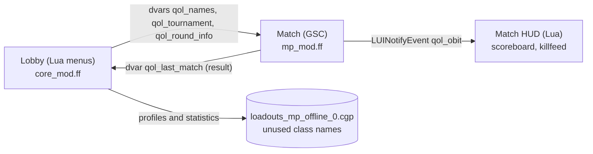
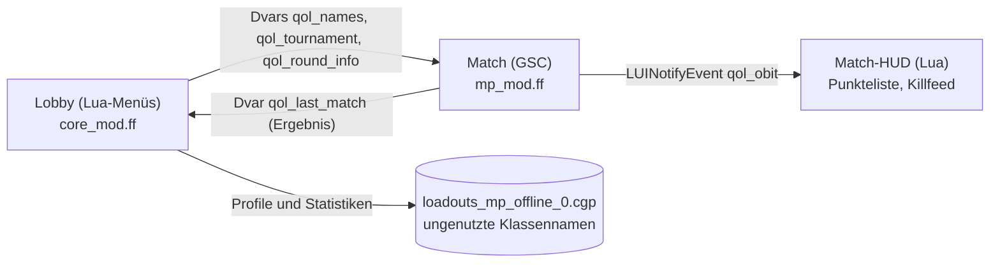

# BO3 Splitscreen QoL

Quality-of-life mod for local two-player splitscreen in **Call of Duty: Black Ops III** (PC, Steam) – offline and LAN.
Offline-Mod für lokalen Zweispieler-Splitscreen in **Call of Duty: Black Ops III** (PC, Steam) – offline und im LAN.

**[English](#english)** · **[Deutsch](#deutsch)**

---

## English

Fixed controller assignment for both players, a splitscreen toggle in the lobby list, side-by-side class editor,
class copying, local profiles with statistics, a local leaderboard and tournaments with game rules – everything
inside the normal game menus.

The mod is nothing but mod files (Lua menus + a GSC game script) loaded through the in-game **Mods** menu. No DLLs,
no extra programs, no Mod Tools on the gaming PC.

> **Note:** all in-game texts of the mod are **German**. This README and the code comments are English/German;
> the developer documentation [HOW_IT_WORKS.md](HOW_IT_WORKS.md) is German as well.

### Contents

- [Status](#status)
- [Features](#features)
- [Installation](#installation)
- [Quick start](#quick-start)
- [Controls in detail](#controls-in-detail)
- [How it works](#how-it-works)
- [Limitations](#limitations)
- [Troubleshooting](#troubleshooting)
- [Building it yourself](#building-it-yourself)
- [Publishing on the Steam Workshop](#publishing-on-the-steam-workshop)
- [Project structure](#project-structure)
- [Contributing](#contributing)
- [Credits](#credits)

### Status

Version **0.7.0** (September 2026). ✅ = confirmed in game with real controllers, 🧪 = built and checked
automatically, but not yet confirmed in game. The basics work, the newer parts still need field testing – hence no
1.0 yet.

| Feature | Status |
| --- | --- |
| Mod loads offline, entries appear in the lobby list | ✅ |
| ACTIVATE/DEACTIVATE SPLITSCREEN in the left lobby list | ✅ |
| Choosing the input device for players 1 and 2, swapping controllers | ✅ |
| Player 2 card (class editor, specialists, scorestreaks with their own controller) | ✅ |
| Split screen: both players in the class editor at the same time | ✅ |
| Unplugging and replugging a controller while the split menu is open | ✅ |
| Creating and picking local profiles ("WER SPIELT?") | ✅ |
| Profiles survive a restart, profile names in the party list at startup | ✅ |
| A profile cannot be picked twice, party names stay after switching profiles | 🧪 |
| Creating a tournament and starting round 1 directly | ✅ |
| Player 1's input device is remembered after a restart | 🧪 |
| Copying classes (one or all) with picture preview | 🧪 |
| "WER SPIELT?" separately in both screen halves | 🧪 |
| Statistics and head-to-head records after a match, leaderboard with values | 🧪 |
| Tournament scoring, next round, winner, team assignment | 🧪 |
| Per-round tournament rules (game settings, bots), restrictions like "snipers only" | 🧪 |
| Saving tournament presets, map pictures, preset file (export/import) | 🧪 |
| Names in the match (scoreboard and killfeed) | 🧪 |
| Renaming/resetting/deleting profiles, storage usage display | 🧪 |
| Mouse support in every mod menu | 🧪 |
| Split screen adapting to a changed window size | 🧪 |
| LAN with two PCs (e.g. 2 + 2 players) | 🧪 |

Feedback on the 🧪 entries is welcome (an issue with a screenshot of the status line, see
[Troubleshooting](#troubleshooting)).

### Features

**Splitscreen and input**
- An entry **SPLITSCREEN AKTIVIEREN** in the left lobby list below CODCASTER – reachable with the D-pad, not just
  with the mouse.
- A new setting **Eingabegerät Spieler 1** ("input device player 1") right above the stock player 2 option:
  *automatic*, *keyboard/mouse only* or a specific controller. Picking the other player's controller swaps them.
- The keyboard always stays available for player 1 as well (handy when a controller disconnects).
- A watchdog restores the chosen assignment whenever BO3 loses it (controller reconnected, player 2 joining).

**Menus**
- **Split screen:** when either player opens the class editor, specialists or scorestreaks, the screen is split
  vertically (player 1 left, player 2 right). Both navigate their own half with their own controller at the same
  time. The halves adapt to aspect ratio and window size.
- **Player 2 card** on the right of the lobby: player 2 opens their menus with their own controller.
- **Copy classes:** one class or all classes from player 1 to player 2 or the other way round, with a picture
  preview of both classes (weapons, attachments, equipment, perks, wildcards) and a confirmation step.
- Every mod menu works with controller, keyboard **and mouse**.

**Profiles, statistics, tournaments**
- **"WER SPIELT?"** ("who is playing?") appears as soon as player 2 joins – inside the split screen, each half on
  its own: whoever has picked can start editing classes while the other one still types a name. A profile cannot be
  used by both players at once.
- **Statistics per profile:** matches, wins, kills, deaths, K/D, headshots and head-to-head records
  ("Anna vs Ben: 12 kills / 4 deaths").
- **Local leaderboard** with sorting and profile management (rename, reset statistics, delete).
- **Profile names** instead of Steam names in the party list, in the in-match scoreboard and in a killfeed of our own.
- **Tournaments** for everybody in the lobby, including players on other PCs in a LAN game:
  - *Teams – best of 3* or *best of 5* (two teams of any size: 1v1, 2v2 … up to the lobby limit),
  - *Free for all – points* (3 rounds, placement points),
  - mode and map per round (with map picture), display names per player, the round starts right away,
  - **game rules** like in "Spiel einrichten" (time and score limit, radar, hardcore, headshots only, spawns,
    health …), **bots** and **restrictions** ("snipers only", "shotguns only", "no scorestreaks" …) – the same for
    every round or per round, and copyable onto the other rounds,
  - **tournament presets**: built-in and custom presets holding format, modes, maps and rules; exportable and
    importable as a file (backup, second PC),
  - after every match: scoring, a standings table and the next round loaded automatically; a draw is replayed.

### Installation

Requirements: Black Ops III for PC (Steam). For two players: two controllers, or keyboard + controller.

#### Via the Steam Workshop

1. Subscribe to the mod in the Black Ops III Steam Workshop.
2. Start BO3 → **MODS** → *BO3 Splitscreen QoL* → **Load**.

#### Manually (ZIP)

1. Download `bo3_splitscreen_qol-<version>.zip` – from *Releases* or from the [release/](release/) folder of this
   project.
2. Extract it into the game's mods folder so that this structure exists:

   ```text
   ...\steamapps\common\Call of Duty Black Ops III\mods\bo3_splitscreen_qol\zone\core_mod.ff
                                                                            \mp_mod.ff
                                                                            \en_core_mod.ff  en_mp_mod.ff
                                                                            \ge_core_mod.ff  ge_mp_mod.ff
   ```

3. Start BO3 → **MODS** → `bo3_splitscreen_qol` → **Load**.

The mod keeps its own save files (`players\mods\bo3_splitscreen_qol\`). Classes and statistics of the unmodded game
stay untouched; with the mod loaded you start with the default classes.

> **Do not go online with the mod loaded.** BO3 only allows mods offline and in LAN; the online area disables them
> again.

### Quick start

1. **MODS** → load the mod → **MULTIPLAYER** → play offline/LAN → **CUSTOM GAME** (or a LAN game).
2. Pick **SPLITSCREEN AKTIVIEREN** in the left list below CODCASTER; player 2 presses a button on their controller
   and signs in.
3. **"WER SPIELT?"** appears split: each player picks a profile in their half with their own controller (or
   `+ NEUES PROFIL`, typing the name on the PC keyboard). Once both have picked, the split screen closes.
4. If the controllers are swapped: **Settings → Controls → Gamepad → Splitscreen** → *Eingabegerät Spieler 1* /
   *Eingabegerät Spieler 2*.
5. Editing classes: one player opens the class editor → the screen splits → both choose **FERTIG** ("done").
6. Start the match as usual. Afterwards the statistics show up in **LOKALE BESTENLISTE** (local leaderboard).

### Controls in detail

Keyboard and mouse always control player 1. In every mod menu:

| Action | Controller | Keyboard | Mouse |
| --- | --- | --- | --- |
| Select a row | D-pad up/down | arrow keys | click the row |
| Change a value | D-pad left/right | arrow keys | left click forward, right click back |
| Confirm | A / cross | Enter | left click |
| Enter a name (tournament) | X / square | space | – |
| Back / done | B / circle | Esc | `[ ZURÜCK ]` / `[ FERTIG ]` |

#### Lobby list (left, below CODCASTER)

| Entry | Who | Purpose |
| --- | --- | --- |
| SPLITSCREEN AKTIVIEREN/DEAKTIVIEREN | host | add or remove player 2 |
| LOKALE PROFILE | everyone | open "WER SPIELT?" again (split when player 2 is present) |
| KLASSEN KOPIEREN | everyone | copy classes between the two local players |
| LOKALE BESTENLISTE | everyone | statistics, head-to-head records, profile management |
| TURNIER | host | set up a tournament, see the standings, start a round |

The entries appear in **custom games** and in LAN lobbies. The offline main menu additionally offers SPLITSCREEN
AKTIVIEREN so a second PC can already be two players before joining a LAN game.

#### Split screen

- Used automatically as soon as player 2 is signed in and either player opens **KLASSENEDITOR**, **SPEZIALISTEN**
  or **PUNKTESERIEN** (from the lobby list or the player 2 card).
- Each half has its own menu: PROFIL · KLASSENEDITOR · SPEZIALISTEN · PUNKTESERIEN · KLASSEN KOPIEREN · FERTIG.
- The split screen closes when **both** halves chose FERTIG (B/Esc in the half's menu).
- If a controller loses its connection, everything stays open and the half shows a hint. Only after player 2 has
  been signed out for ten seconds does the mod save and close.

#### Copying classes

Rows: **Umfang** (one class / all classes) · **Von** (source player) · **Klasse** · **Nach** (target player) ·
**Klasse** · **KOPIEREN**. Below, two previews show the source class (VON) and the class that will be overwritten
(NACH) with pictures and names; "all classes" shows a list instead. Overwriting asks for confirmation. Copied are
weapons, attachments, perks, wildcards, equipment, camos/paintjobs and the class name. Specialist and scorestreaks
are not part of a class and are not copied.

#### Profiles and leaderboard

- **"WER SPIELT?"** opens 1.5 seconds after player 2 joined, inside the split screen. Player 1 picks on the left,
  player 2 on the right, each with their own controller. Whoever has picked sees their half's menu and can open the
  class editor right away. `OHNE PROFIL` plays under the Steam name. The profile can be changed later via **PROFIL**
  in the half's menu or **PROFIL WÄHLEN** on the player 2 card.
- In the **leaderboard**, left/right sorts (wins, K/D, kills, headshots, matches). A/Enter or a click on a profile
  opens UMBENENNEN (rename), STATISTIK ZURÜCKSETZEN (reset) and PROFIL LÖSCHEN (delete).
- The top right of the leaderboard shows how full the profile storage is (see [Limitations](#limitations)).
- Counted are matches hosted by this PC in which the player had picked a profile. A win counts when your team (or,
  in free for all, you) are alone in front.

#### Tournament

1. **TURNIER** (host) → pick a **VORLAGE** (preset) at the top and load it with A/Enter – or set the **format**
   yourself.
2. **Regeln:** *the same for all rounds* or *per round*.
3. Set **mode** and **map** for every round; the right side shows the map picture, the mode and the round's rules.
4. Open **REGELN** (rules): every setting from "Spiel einrichten" for the chosen modes, plus bots and restrictions.
   Left/right changes a value (green = changed, *Standard* = the mode's default). Quick choices set fixed modes like
   "snipers only"; forbidden items cannot be equipped in the class editor, so everybody has to build a fitting
   class. In *per round* mode there are **DIESE REGELN FÜR ALLE RUNDEN ÜBERNEHMEN** (copy to all rounds) and
   **REGELN VON RUNDE n ÜBERNEHMEN** (take over from round n).
5. **TEAMS EINTEILEN**: every player in the lobby (also from other PCs). Left/right switches the team, X/space sets
   a display name (used in the party list, scoreboard and killfeed), **LOBBY NEU EINLESEN** picks up players who
   joined later.
6. **ALS VORLAGE SPEICHERN** (optional): store format, rounds, maps and rules under a name.
7. **TURNIER STARTEN** loads round 1 (mode, map, rules, teams) and starts the match immediately.
8. After the match the standings open with the next round already set up → **RUNDE n STARTEN**.

Built-in presets: *Klassiker*, *Scharfschützen* (snipers), *Nur Kopfschüsse* (headshots only), *Hardcore*,
*Schrotflinten* (shotguns), *Jeder gegen jeden* (free for all). Maps a preset does not name are distributed
automatically.

**Preset file** (TURNIER → VORLAGEN-DATEI): BO3 must not write files, so the export goes through the console log.
- *Export* writes all custom presets as ready-made command lines into `console_mp.log` in the mod folder (the path
  is shown in the menu). Copy the block between the `=====` lines into a text file `qol_turniere.cfg`.
- *Load* reads `qol_turniere.cfg` (location: see the menu) and takes over every preset – identical names are
  replaced.
- *Paste code*: paste a preset code (starts with `T1~`) straight into the text field.

Scoring:
- *Teams:* the round winner is the team with more points (BO3's team score, otherwise the sum of the personal
  scores). A draw replays the round. Whoever wins 2 (best of 3) or 3 (best of 5) rounds first wins the tournament.
- *Free for all:* per round the last place gets 1 point, every place above one more. After 3 rounds the player with
  the most points wins.
- A match without any tournament player (e.g. played before the tournament was created) is not scored.
- On spawn the match shows a hint "TURNIER Runde x/y: TEAM A (…) vs TEAM B (…)" including the rules.

#### LAN with several PCs

Example: 4 players on 2 PCs, 2 in splitscreen each.

1. **Both PCs** load the same version of the mod (on the Workshop: both subscribe) and are on the same network.
2. PC 1 (host) opens a LAN lobby and activates splitscreen there.
3. PC 2 picks **SPLITSCREEN AKTIVIEREN** in the offline multiplayer main menu (both players sign in) and then joins
   via **LAN-SPIEL SUCHEN**.
4. The host sets up e.g. 2v2 in **TURNIER** and starts.

PC 2 has its own profiles and can copy classes and use the split menus. Statistics are only counted on the host
(see limitations).

### How it works



**Entry point without a DLL.** When the menu starts, BO3 loads a list of Lua files
(`ui/uieditor/menus/core_frontend_patch_require.lua`). The mod ships that file with the stock list plus
`pcall(require, "ui.qol.main")`. The same applies in a match via `core_patch_require.lua` → `ui.qol.ingame`. Every
module is loaded in its own `pcall`; a failure never breaks the stock menu, it shows up in the status line instead.

**Hooks into the stock menus** (all of them wrappers around the original function):

| Hook | Purpose |
| --- | --- |
| `CoD.LobbyMenus.AddButtonsForTarget` | extra entries in the lobby list |
| `LUI.createMenu.Lobby` | player 2 card, status line, data start, evaluation after a match |
| `CoD.Menu.HandleButtonPress` | catch player 2's controller input for the player 2 card |
| `DataSources.OptionGamepadSettingsPC.prepare` | the "Eingabegerät Spieler 1" row and the swap logic for player 2 |
| `CoD.LobbyButtons.MP_CAC / MP_SPECIALISTS / MP_SCORESTREAKS` | open these menus inside the split screen |
| `CoD.LobbyUtility.UpdateLobbyList` | profile names in the party list |
| `GetClientNameAndClanTag`, `LUI.createMenu.T7Hud` | names in the scoreboard, own killfeed |

**Controllers.** The PC build has an engine API for the assignment
(`Engine.GamepadsConnectedMap/UnMap/Port/…`) that the stock player 2 option uses as well. The mod builds the player
1 option on top of it, swaps controllers that are already taken and checks once per second whether the assignment
still matches the setting.

**Split screen.** An overlay above the lobby holds two stencil-clipped halves. Each half contains a scaled
1280×720 stage with a small menu owned by that player's controller, and the stock menus are opened from there. BO3
attaches new menus to the parent of the opening menu, so the whole chain stays inside its half, and every menu only
reacts to its own controller's buttons. The scale comes from the real half width (16:9, 16:10, 21:9, windowed).

**Saving without file access.** Mods must not write their own files. The mod therefore stores a short text in the
class names of the class sets for private and league **online** matches (`customMatchCacLoadouts`,
`leagueCacLoadouts`). They exist in the offline class file but are never used offline. BO3 writes them together
with the normal classes into `players\mods\<mod>\loadouts_mp_offline_0.cgp`. Format:
`Q2|<length>|B<starts>;P<id>,<kills>,<deaths>,<headshots>,<matches>,<wins>,<name>;V<id>,<id>,<kills>;A<id p1>,<id p2>;I<input>`.

**Match evaluation.** `scripts/mp/gametypes/_clientids.gsc` (the stock file plus additions) wraps
`level.callbackPlayerKilled`: every kill sends a `LUINotifyEvent` to the HUD (killfeed) and kills between players
are counted. On `game_ended` the script writes a result with mode, map, team scores and all players into the dvar
`qol_last_match`. Back in the lobby the menu reads that dvar, matches the entries to the local players, and stores
statistics, head-to-head records and the tournament result.

**Session data.** Dvars survive the switch lobby ↔ match because the engine keeps them while the Lua menus are
reloaded. The name table (`qol_names`), the tournament state (`qol_tournament`) and the round hint travel that way.
They are gone when the game is closed; profiles and statistics live in the storage above.

**Safety nets.**
- Every hook and button action runs protected (`pcall`); errors show up as "FEHLER: …" in the status line.
- A **self-test** checks the pure logic on every menu start (storage format, name table, match result, tournament
  scoring including draws and free for all).
- At build time `tools/lua_lint.py` parses every Lua file with a complete Lua 5.1 parser and reports syntax errors
  and unknown or newly created global names. BO3 forbids new globals after the menu has started; such mistakes
  would otherwise only surface in game.

### Limitations

- **Offline and LAN only.** With the mod loaded BO3 cannot go online.
- **Profile storage holds about 300 characters** – enough for roughly 4–6 profiles with head-to-head records. When
  it gets tight the mod drops the records with the fewest kills first. If there is still no room, creating a profile
  is refused → delete old profiles in the leaderboard.
- **Statistics only on the host.** The match script runs on the PC hosting the game. Profiles on a PC that joined
  via LAN get no statistics.
- **Names from other PCs:** in the party list and in the match, players from other PCs appear with their Steam name
  unless the host gives them a display name in the tournament. The names above players' heads are drawn by the
  engine and cannot be changed.
- **Killfeed:** the mod's killfeed appears as soon as profile or tournament names are active and hides the stock one
  (in splitscreen BO3 does not show one anyway).
- **Tournament state** only lasts while the game is running (not across a restart).
- **Tournament presets** live in a second, larger store inside unused fields of the same class file (a few hundred
  characters, enough for several presets). If it is unavailable, custom presets only last until the next restart –
  use the preset file then.
- **Restrictions** use the engine's item locks. Whether BO3 enforces them in every offline mode is not confirmed yet.
- **Team assignment in tournaments:** the mod assigns teams through BO3's host assignment. Whether BO3 keeps them in
  every mode is not confirmed; scoring follows the teams actually played in the match.
- **Specialists in the split screen:** the 3D character exists only once, so the halves use a dark background.
- **Entering names** goes through BO3's text field, in practice through the PC keyboard.
- The mod's menu texts are German.

### Troubleshooting

| Problem | Solution |
| --- | --- |
| Black screen after "Load" | The first load of a mod can take up to a minute. |
| "Could not find zone ge_mp_mod" or similar | Incomplete installation – all six `.ff` files must sit in the `zone` folder. |
| Entries missing in the lobby | Is the mod loaded? They only appear in custom games and LAN lobbies, TURNIER only for the host. |
| Controllers swapped / player 1 does not react | Set *Eingabegerät Spieler 1* to a fixed controller; the keyboard always works. |
| "FEHLER: …" appears at the top | Post a screenshot of that line in an issue. |
| "Profile nicht gespeichert: Speicher voll" | Delete unused profiles in the leaderboard. |
| Mod suddenly disabled | The online area was opened – load the mod again and stay offline. |

The development build (`bo3_qol_dev`) shows a status line at the top with version, controller assignment, storage
state and self-test. Its console log is at `...\Call of Duty Black Ops III\mods\bo3_qol_dev\console_mp.log`.

### Building it yourself

For developers only; playing just needs the finished package.

**Requirements**
- *Call of Duty: Black Ops III – Mod Tools* (Steam → Library → Tools).
- **L3akMod** (The D3V Team) installed into the Mod Tools – the official tools cannot link Lua menus in mods.
- Windows PowerShell 5.1; Python 3 (optional, for `tools/lua_lint.py`).
- `build-dev.ps1` contains the paths `$toolsRoot` (Mod Tools) and `$gameRoot` (game) – adjust them for a different
  Steam library.

**Building**

```powershell
# development build "bo3_qol_dev" (status line, console log), installed into the game (BO3 must be closed)
powershell -NoProfile -ExecutionPolicy Bypass -File .\build-dev.ps1 -Install

# release "bo3_splitscreen_qol": status line only on errors, ZIP in dist\
powershell -NoProfile -ExecutionPolicy Bypass -File .\build-dev.ps1 -Release -Version 1.0.0
```

The script
1. checks that every Lua file is listed in the zone recipe (and vice versa) and that no file has a UTF-8 BOM,
2. parses all Lua files with `tools/lua_lint.py`,
3. rebuilds `<Mod Tools>\mods\<modname>`, patching version and `QoL.DEV = false` for a release,
4. links `core_mod` and `mp_mod` for English and German and aborts on linker errors,
5. verifies that all fastfiles and Lua files ended up in the package,
6. copies to `dist\` (plus a ZIP for releases) and installs into the game with `-Install`.

Logs and checksums end up in `investigation\build-logs\<time>\`.

**Rules for changes**
- New Lua file → add it to `development/zone_source/core_mod.zone` and load it in `ui/qol/main.lua`.
- Save Lua files as UTF-8 **without** BOM; `build-dev.ps1` itself stays UTF-8 **with** BOM (PowerShell 5.1 and
  umlauts).
- No new global variables; everything hangs off `CoD.QoL`.
- Put pure logic (without `Engine.*`) into testable functions and cover it in `ui/qol/selftest.lua`.
- For research, the stock Lua files can be extracted from `core_frontend_patch.ff` / `core_patch.ff` with *Atian Cod
  Tools* and decompiled with *CoDLuaDecompiler*. Decompiled stock files do not belong in this repository.

### Publishing on the Steam Workshop

Uploading is done with the BO3 Mod Tools launcher. After a release build the fastfiles are already in the right
place.

1. **Build and test the release**

   ```powershell
   powershell -NoProfile -ExecutionPolicy Bypass -File .\build-dev.ps1 -Release -Version 1.0.0 -Install
   ```

   Then load the mod `bo3_splitscreen_qol` offline in BO3 and check it briefly (lobby entries there, no error line).
   The build now sits in `...\Call of Duty Black Ops III 455130\mods\bo3_splitscreen_qol\zone\`.
2. **Prepare a thumbnail:** square, e.g. 512×512 px as PNG or JPG, ideally below 1 MB.
3. **Start the Mod Tools launcher:** Steam → Library → Tools → *Call of Duty Black Ops III – Mod Tools*
   (`bin\modlauncher.exe`).
4. Select `bo3_splitscreen_qol` under **mods** on the left and click **Publish** (the upload icon).
5. Fill in **Title**, **Description** (short text plus a link to GitHub), **Thumbnail** and **Tags**, then publish.
   The launcher uploads the mod folder and offers to open the Workshop page afterwards.
6. **On the Workshop page** set the visibility (private/friends only for testing, then public), add screenshots and
   check the description. On the very first upload Steam may require you to accept the Workshop agreement first.
7. **Test it yourself:** subscribe, restart BO3, load the Workshop version from the Mods menu.

**Updates:** on the first upload the launcher creates `mods\bo3_splitscreen_qol\zone\workshop.json` containing the
Workshop ID. Only with that file does *Publish* update the same Workshop item instead of creating a new one.
`build-dev.ps1` therefore backs it up to `workshop\bo3_splitscreen_qol\workshop.json` on every build and puts it
back afterwards – so keep that file in the repository. Update procedure: raise the version →
`-Release -Version x.y.z` → test → **Publish** again → add change notes on the Workshop page.

Notes:
- Everyone in a LAN game needs the same mod version (easiest: everybody subscribes to the Workshop mod).
- The Workshop version and a manually installed one live in different folders and therefore most likely have
  separate profiles and classes – better use only one of them.
- The title must not present Activision/Treyarch logos or brands as your own.

### Project structure

```text
development/                      mod sources (copied into the Mod Tools)
  ui/uieditor/menus/
    core_frontend_patch_require.lua   menu entry point: stock require list + ui.qol.main
    core_patch_require.lua            match HUD entry point: stock require list + ui.qol.ingame
  ui/qol/
    main.lua          loads every module separately, runs the self-test
    util.lua          CoD.QoL, version/DEV switch, log, errors, session values
    ui.lua            toolkit: menus, buttons, mouse, lists, text input
    input.lua         input device player 1, controller swapping, watchdog
    lobbybuttons.lua  entries in the lobby list
    splitlobby.lua    lobby hook: player 2 card, status line, evaluation after a match
    splitmenu.lua     split screen
    classcopy.lua     copying classes
    storage.lua       permanent text store inside unused class names
    data.lua          profiles, head-to-head records, storage format
    stats.lua         reading and evaluating the match result
    profiles.lua      "WER SPIELT?", names in the party list
    leaderboard.lua   local leaderboard, profile management
    bigstore.lua      additional store (bit stream in unused class fields) for presets
    rules.lua         game rules: settings, bots, restrictions, applying
    presets.lua       tournament presets, export/import
    tournament.lua    tournament formats, scoring, starting a round
    tournamentmenu.lua tournament screen with preview
    names.lua         name table for lobby and match
    ingame.lua        in match: scoreboard, killfeed
    selftest.lua      self-test of the pure logic
  scripts/mp/gametypes/_clientids.gsc   match: kill counting, killfeed events, result dvar
  zone_source/core_mod.zone, mp_mod.zone zone recipes
build-dev.ps1                     build (development and release)
tools/lua_lint.py                 Lua 5.1 parser and global-name check
workshop/                         saved workshop.json (after the first upload)
HOW_IT_WORKS.md                   developer documentation (German)
docs/                             original requirements, older notes
investigation/                    research notes and build logs
release/                          finished ZIP for downloading
legacy/                           0.2.x leftovers, no longer used
```

### Contributing

1. Read [HOW_IT_WORKS.md](HOW_IT_WORKS.md) (German) – it covers the required software, the architecture, the data
   formats and the rules for changes (no new globals, UTF-8 without BOM, new files into the zone recipe, everything
   in `pcall`).
2. Sources live in `development/`; build and check after every change:

   ```bash
   powershell -NoProfile -ExecutionPolicy Bypass -File .\build-dev.ps1 -Install
   ```

3. `tools/lua_lint.py` runs before every build, and a self-test of the pure logic runs in game. Please cover new
   logic without engine calls in `development/ui/qol/selftest.lua`.
4. Once something is confirmed in game, move it from 🧪 to ✅ in the status table – "compiled" is not "tested".

### Credits

- Development: Felix – with the help of AI assistants (ChatGPT/Codex, Claude).
- **L3akMod** – The D3V Team (DTZxPorter, SE2Dev, Nukem): Lua support for the BO3 Mod Tools.
- **Atian Cod Tools** and **CoDLuaDecompiler**: used to study the stock menu scripts.
- *Call of Duty: Black Ops III* © Activision Publishing, Inc. / Treyarch. This is an unofficial fan project and is
  not affiliated with Activision or Treyarch. The mod contains only its own scripts plus the stock require lists
  needed to load them.

---

## Deutsch

Offline-Mod für **Call of Duty: Black Ops III (PC, Steam)**, die lokalen Splitscreen am Laptop oder PC deutlich
angenehmer macht: feste Controller-Zuordnung für beide Spieler, geteilter Bildschirm im Klasseneditor, Klassen
kopieren, lokale Spielerprofile mit Statistiken, eine lokale Bestenliste und Turniere – auch über LAN.

Die Mod besteht nur aus Mod-Dateien (Lua-Menüs + GSC-Spielskript), die über das normale **Mods**-Menü von BO3
geladen werden. Keine DLLs, keine Zusatzprogramme, keine Mod Tools auf dem Spiel-PC.

Technische Dokumentation für Mitentwickler: **[HOW_IT_WORKS.md](HOW_IT_WORKS.md)**.

### Inhalt

- [Stand](#stand)
- [Funktionen](#funktionen)
- [Einrichten](#einrichten)
- [Schnellstart](#schnellstart)
- [Bedienung im Detail](#bedienung-im-detail)
- [Wie es funktioniert](#wie-es-funktioniert)
- [Grenzen und bekannte Einschränkungen](#grenzen-und-bekannte-einschränkungen)
- [Fehlersuche](#fehlersuche)
- [Selbst bauen](#selbst-bauen)
- [Im Steam Workshop veröffentlichen](#im-steam-workshop-veröffentlichen)
- [Projektstruktur](#projektstruktur)
- [Mitentwickeln](#mitentwickeln)
- [Mitwirkende](#mitwirkende)

### Stand

Version **0.7.0** (September 2026). ✅ = im Spiel mit echten Controllern getestet, 🧪 = gebaut und automatisch
geprüft, im Spiel aber noch nicht bestätigt. Die Grundfunktionen laufen, die neueren Teile brauchen noch
Praxistests – deshalb noch keine 1.0.

| Funktion | Status |
| --- | --- |
| Mod lädt offline, Einträge in der Lobby-Liste | ✅ |
| SPLITSCREEN AKTIVIEREN/DEAKTIVIEREN in der linken Lobby-Liste | ✅ |
| Eingabegerät Spieler 1 und 2 wählen, Controller tauschen | ✅ |
| Spieler-2-Karte (Klasseneditor, Spezialisten, Punkteserien mit dem eigenen Controller) | ✅ |
| Geteilter Bildschirm: beide Spieler gleichzeitig im Klasseneditor | ✅ |
| Controller-Kabel ziehen/wieder einstecken während des geteilten Menüs | ✅ |
| Lokale Profile „WER SPIELT?“ anlegen und wählen | ✅ |
| Profile bleiben nach Neustart erhalten, Profilnamen beim Start in der Party-Liste | ✅ |
| Profil nicht doppelt wählbar, Party-Namen auch nach Profilwechsel | 🧪 |
| Turnier anlegen und erste Runde direkt starten | ✅ |
| Eingabegerät Spieler 1 bleibt nach Neustart gespeichert | 🧪 |
| Klassen kopieren (eine oder alle Klassen) mit Bild-Vorschau | 🧪 |
| „WER SPIELT?“ getrennt in beiden Bildschirmhälften | 🧪 |
| Statistiken und Duelle nach einem Match, lokale Bestenliste mit Werten | 🧪 |
| Turnierwertung, nächste Runde, Sieger, Teamzuteilung | 🧪 |
| Turnier-Regeln je Runde (Spiel einrichten, Bots), Beschränkungen wie „Nur Scharfschützengewehre“ | 🧪 |
| Turniervorlagen speichern, Kartenbilder, Vorlagen-Datei (Export/Import) | 🧪 |
| Namen im Match (Punkteliste und Killfeed) | 🧪 |
| Profile umbenennen/zurücksetzen/löschen, Speicheranzeige | 🧪 |
| Mausbedienung in allen Mod-Menüs | 🧪 |
| Anpassung des geteilten Bildschirms bei geänderter Fenstergröße | 🧪 |
| LAN mit zwei Rechnern (z. B. 2 + 2 Spieler) | 🧪 |

Rückmeldungen zu den 🧪-Punkten sind willkommen (Issue mit Screenshot der Statuszeile, siehe
[Fehlersuche](#fehlersuche)).

### Funktionen

**Splitscreen und Eingabe**
- Eintrag **SPLITSCREEN AKTIVIEREN** in der linken Lobby-Liste unter CODCASTER – mit Steuerkreuz erreichbar,
  nicht nur mit der Maus.
- Neue Einstellung **Eingabegerät Spieler 1** direkt über „Eingabegerät Spieler 2“: *Automatisch*, *Nur
  Tastatur/Maus* oder ein bestimmter Controller. Wählt ein Spieler den Controller des anderen, wird getauscht.
- Die Tastatur bleibt für Spieler 1 immer zusätzlich aktiv (z. B. wenn ein Controller die Verbindung verliert).
- Ein Wächter im Hintergrund stellt die gewählte Zuordnung wieder her, wenn BO3 sie verliert (Controller neu
  verbunden, Spieler 2 tritt bei).

**Menüs**
- **Geteilter Bildschirm:** Öffnet einer der beiden Klasseneditor, Spezialisten oder Punkteserien, wird der
  Bildschirm senkrecht geteilt (links Spieler 1, rechts Spieler 2). Beide bedienen ihre Hälfte gleichzeitig mit
  dem eigenen Controller. Die Hälften passen sich an Seitenverhältnis und Fenstergröße an.
- **Spieler-2-Karte** rechts in der Lobby: Spieler 2 öffnet seine Menüs mit dem eigenen Controller.
- **Klassen kopieren:** eine oder alle Klassen von Spieler 1 zu Spieler 2 oder umgekehrt, mit Bild-Vorschau beider
  Klassen (Waffen, Aufsätze, Ausrüstung, Extras, Wildcards) und Sicherheitsabfrage.
- Alle Mod-Menüs lassen sich mit Controller, Tastatur **und Maus** bedienen.

**Profile, Statistiken, Turniere**
- **WER SPIELT?** erscheint, sobald Spieler 2 beitritt – im geteilten Bildschirm, jede Hälfte für sich: Wer gewählt
  hat, kann sofort Klassen bearbeiten, während der andere noch seinen Namen eintippt. Ein Profil kann nicht von
  beiden gleichzeitig gewählt werden.
- **Statistiken je Profil:** Spiele, Siege, Kills, Tode, K/D, Kopfschüsse und Duelle („Anna gegen Ben: 12 Kills /
  4 Tode“).
- **LOKALE BESTENLISTE** mit Sortierung und Profilverwaltung (umbenennen, Statistik zurücksetzen, löschen).
- **Profilnamen** statt Steam-Namen in der Party-Liste, in der Punkteliste im Match und in einem eigenen Killfeed.
- **TURNIER** für alle Spieler der Lobby, auch von anderen Rechnern im LAN:
  - *Teams – Best of 3* oder *Best of 5* (2 Teams beliebiger Größe: 1v1, 2v2 … bis zur Lobby-Grenze),
  - *Jeder gegen jeden – Punkte* (3 Runden, Platzierungspunkte),
  - Modus und Karte je Runde frei wählbar (mit Kartenbild), Anzeigenamen je Spieler, Runde startet direkt,
  - **Spielregeln** wie unter „Spiel einrichten“ (Zeit- und Punktelimit, Radar, Hardcore, nur Kopfschüsse, Spawn,
    Gesundheit …), **Bots** und **Beschränkungen** („Nur Scharfschützengewehre“, „Nur Schrotflinten“, „Ohne
    Punkteserien“ …) – für alle Runden gleich oder je Runde, auf andere Runden kopierbar,
  - **Turniervorlagen**: eingebaute und eigene Vorlagen mit Format, Modi, Karten und Regeln; als Datei exportier-
    und importierbar (Backup, anderer Rechner),
  - nach jedem Match Wertung, Tabelle und automatisch die nächste Runde; Unentschieden wird wiederholt.

### Einrichten

Voraussetzung: Black Ops III für PC (Steam). Für zwei Spieler zwei Controller oder Tastatur + Controller.

#### Über den Steam Workshop

1. Die Mod im Steam Workshop von Black Ops III abonnieren.
2. BO3 starten → **MODS** → *BO3 Splitscreen QoL* → **Laden**.

#### Manuell (ZIP)

1. `bo3_splitscreen_qol-<version>.zip` herunterladen – unter *Releases* oder aus dem Ordner
   [release/](release/) dieses Projekts.
2. In den Mods-Ordner des Spiels entpacken, sodass diese Struktur entsteht:

   ```text
   ...\steamapps\common\Call of Duty Black Ops III\mods\bo3_splitscreen_qol\zone\core_mod.ff
                                                                            \mp_mod.ff
                                                                            \en_core_mod.ff  en_mp_mod.ff
                                                                            \ge_core_mod.ff  ge_mp_mod.ff
   ```

3. BO3 starten → **MODS** → `bo3_splitscreen_qol` → **Laden**.

Die Mod legt ihre eigenen Spielstände an (`players\mods\bo3_splitscreen_qol\`). Klassen und Statistiken des
normalen Spiels bleiben unberührt; beim ersten Start mit Mod gelten die Standardklassen.

> **Nicht mit geladener Mod online gehen.** BO3 erlaubt Mods nur offline bzw. im LAN; der Online-Bereich
> deaktiviert die Mod wieder.

### Schnellstart

1. **MODS** → Mod laden → **MEHRSPIELER** → offline/LAN spielen → **EIGENES SPIEL** (oder LAN-Spiel).
2. In der linken Liste unter CODCASTER **SPLITSCREEN AKTIVIEREN** wählen; Spieler 2 drückt eine Taste auf seinem
   Controller und meldet sich an.
3. **WER SPIELT?** erscheint geteilt: Jeder wählt in seiner Hälfte mit seinem Controller ein Profil (oder
   `+ NEUES PROFIL`, Namen tippt man auf der PC-Tastatur). Haben beide gewählt, schließt sich der geteilte Bildschirm.
4. Falls die Controller vertauscht sind: **Einstellungen → Steuerung → Gamepad → Splitscreen** →
   *Eingabegerät Spieler 1* / *Eingabegerät Spieler 2*.
5. Klassen bearbeiten: Einer öffnet den Klasseneditor → der Bildschirm teilt sich → beide wählen **FERTIG**.
6. Spiel starten wie gewohnt. Nach dem Match stehen Statistiken in **LOKALE BESTENLISTE**.

### Bedienung im Detail

Tastatur und Maus steuern immer Spieler 1. In allen Mod-Menüs gilt:

| Aktion | Controller | Tastatur | Maus |
| --- | --- | --- | --- |
| Zeile wählen | Steuerkreuz hoch/runter | Pfeiltasten | Zeile anklicken |
| Wert ändern | Steuerkreuz links/rechts | Pfeiltasten | Linksklick vor, Rechtsklick zurück |
| Ausführen | A / Kreuz | Enter | Linksklick |
| Name eingeben (Turnier) | X / Quadrat | Leertaste | – |
| Zurück / fertig | B / Kreis | Esc | `[ ZURÜCK ]` / `[ FERTIG ]` |

#### Lobby-Liste (links, unter CODCASTER)

| Eintrag | Wer | Zweck |
| --- | --- | --- |
| SPLITSCREEN AKTIVIEREN/DEAKTIVIEREN | Host | Spieler 2 hinzufügen/entfernen |
| LOKALE PROFILE | alle | „WER SPIELT?“ erneut öffnen (geteilt, wenn Spieler 2 da ist) |
| KLASSEN KOPIEREN | alle | Klassen zwischen den beiden lokalen Spielern kopieren |
| LOKALE BESTENLISTE | alle | Statistiken, Duelle, Profile verwalten |
| TURNIER | Host | Turnier einrichten, Stand ansehen, Runde starten |

Die Einträge erscheinen in **Eigenes Spiel** und in LAN-Lobbys. Im Offline-Hauptmenü gibt es zusätzlich
SPLITSCREEN AKTIVIEREN, damit ein zweiter Rechner schon vor dem LAN-Beitritt zu zweit ist.

#### Geteilter Bildschirm

- Wird automatisch benutzt, sobald Spieler 2 angemeldet ist und einer der beiden **KLASSENEDITOR**,
  **SPEZIALISTEN** oder **PUNKTESERIEN** öffnet (über die Lobby-Liste oder die Spieler-2-Karte).
- Jede Hälfte hat ein eigenes Menü: PROFIL · KLASSENEDITOR · SPEZIALISTEN · PUNKTESERIEN · KLASSEN KOPIEREN · FERTIG.
- Der geteilte Bildschirm schließt sich, wenn **beide** FERTIG gewählt haben (B/Esc im Hälften-Menü).
- Verliert ein Controller die Verbindung, bleibt alles offen und die Hälfte zeigt einen Hinweis. Erst wenn Spieler 2
  zehn Sekunden lang abgemeldet ist, wird gespeichert und geschlossen.

#### Klassen kopieren

Zeilen: **Umfang** (eine Klasse / alle Klassen) · **Von** (Spieler) · **Klasse** · **Nach** (Spieler) · **Klasse** ·
**KOPIEREN**. Darunter zeigen zwei Vorschauen die Quellklasse (VON) und die Klasse, die überschrieben wird (NACH), mit
Bildern und Namen; bei „Alle Klassen“ eine Liste aller Klassen. Vor dem Überschreiben kommt eine Sicherheitsabfrage.
Kopiert werden Waffen, Aufsätze, Extras, Wildcards, Ausrüstung, Tarnungen/Lackierungen und der Klassenname.
Spezialist und Punkteserien gehören nicht zur Klasse und werden nicht kopiert.

#### Profile und Bestenliste

- **WER SPIELT?** öffnet sich 1,5 Sekunden nachdem Spieler 2 beigetreten ist, im geteilten Bildschirm. Links wählt
  Spieler 1, rechts Spieler 2 – jeweils mit dem eigenen Controller. Wer gewählt hat, sieht sein Hälften-Menü und kann
  z. B. schon den Klasseneditor öffnen. `OHNE PROFIL` spielt unter dem Steam-Namen. Über **PROFIL** im Hälften-Menü
  oder **PROFIL WÄHLEN** auf der Spieler-2-Karte lässt sich das Profil später ändern.
- In der **LOKALEN BESTENLISTE** mit links/rechts sortieren (Siege, K/D, Kills, Kopfschüsse, Spiele). A/Enter oder
  Klick auf ein Profil öffnet UMBENENNEN, STATISTIK ZURÜCKSETZEN, PROFIL LÖSCHEN.
- Oben rechts zeigt die Bestenliste, wie voll der Profilspeicher ist (siehe
  [Grenzen](#grenzen-und-bekannte-einschränkungen)).
- Gezählt werden Matches, die dieser Rechner hostet und in denen der Spieler ein Profil gewählt hat. Ein Sieg zählt,
  wenn das eigene Team (bzw. im Jeder-gegen-jeden der Spieler) allein vorne liegt.

#### Turnier

1. **TURNIER** (Host) → oben eine **VORLAGE** wählen und mit A/Enter laden – oder **Format** selbst einstellen.
2. **Regeln:** *Für alle Runden gleich* oder *Je Runde einzeln*.
3. Für jede Runde **Modus** und **Karte** einstellen; rechts erscheinen Kartenbild, Modus und Regeln der Runde.
4. **REGELN** öffnen: Alle Einstellungen aus „Spiel einrichten“ für die gewählten Modi, dazu Bots und Beschränkungen.
   Links/rechts ändert einen Wert (grün = geändert, *Standard* = Voreinstellung des Modus). Schnellwahlen setzen
   feste Modi wie „Nur Scharfschützengewehre“; verbotene Gegenstände lassen sich im Klasseneditor nicht ausrüsten,
   also baut sich jeder eine passende Klasse. Im Modus *Je Runde* gibt es **DIESE REGELN FÜR ALLE RUNDEN
   ÜBERNEHMEN** und **REGELN VON RUNDE n ÜBERNEHMEN**.
5. **TEAMS EINTEILEN**: alle Spieler der Lobby (auch von anderen Rechnern). Links/rechts wechselt das Team,
   X/Leertaste vergibt einen Anzeigenamen (wird in Party-Liste, Punkteliste und Killfeed benutzt),
   **LOBBY NEU EINLESEN** übernimmt neu beigetretene Spieler.
6. **ALS VORLAGE SPEICHERN** (optional): Format, Runden, Karten und Regeln unter einem Namen sichern.
7. **TURNIER STARTEN** lädt Runde 1 (Modus, Karte, Regeln, Teams) und startet das Match sofort.
8. Nach dem Match öffnet sich die Tabelle, die nächste Runde ist schon eingestellt → **RUNDE n STARTEN**.

Eingebaute Vorlagen: *Klassiker*, *Scharfschützen*, *Nur Kopfschüsse*, *Hardcore*, *Schrotflinten*, *Jeder gegen jeden*.
Karten, die eine Vorlage nicht festlegt, werden automatisch verteilt.

**Vorlagen-Datei** (TURNIER → VORLAGEN-DATEI): BO3 darf keine Dateien schreiben, deshalb läuft der Export über das
Konsolenprotokoll.
- *Exportieren* schreibt alle eigenen Vorlagen als fertige Befehlszeilen in `console_mp.log` im Mod-Ordner
  (Pfad steht im Menü). Den Block zwischen den `=====`-Zeilen in eine Textdatei `qol_turniere.cfg` kopieren.
- *Laden* liest `qol_turniere.cfg` (Speicherort: siehe Menü) und übernimmt alle Vorlagen – gleiche Namen werden
  ersetzt.
- *Code einfügen*: den Vorlagen-Code (beginnt mit `T1~`) direkt in das Textfeld einfügen.

Wertung:
- *Teams:* Rundensieger ist das Team mit mehr Punkten (Team-Punktestand von BO3, sonst die Summe der
  persönlichen Punkte). Gleichstand → die Runde wird wiederholt. Wer zuerst 2 (Best of 3) bzw. 3 (Best of 5)
  Runden gewinnt, gewinnt das Turnier.
- *Jeder gegen jeden:* pro Runde bekommt der Letzte 1 Punkt, jeder Platz darüber einen mehr. Nach 3 Runden gewinnt
  der Spieler mit den meisten Punkten.
- Ein Match ohne Turnierspieler (z. B. vor dem Anlegen gespielt) wird nicht gewertet.
- Beim Spawnen zeigt das Match einen Hinweis „TURNIER Runde x/y: TEAM A (…) vs TEAM B (…)“ mit den Regeln.

#### LAN mit mehreren Rechnern

Beispiel: 4 Spieler an 2 Rechnern, je 2 im Splitscreen.

1. **Beide Rechner** laden dieselbe Version der Mod (bei Workshop: beide abonnieren) und sind im selben Netzwerk.
2. Rechner 1 (Host) öffnet eine LAN-Lobby und aktiviert dort den Splitscreen.
3. Rechner 2 wählt im Offline-Mehrspieler-Hauptmenü **SPLITSCREEN AKTIVIEREN** (beide Spieler anmelden) und tritt
   danach über **LAN-SPIEL SUCHEN** bei.
4. Der Host richtet über **TURNIER** z. B. 2v2 ein und startet.

Rechner 2 hat eigene Profile und kann Klassen kopieren und die geteilten Menüs benutzen. Statistiken werden nur auf
dem Host gezählt (siehe Grenzen).

### Wie es funktioniert



**Einstieg ohne DLL.** BO3 lädt beim Start des Menüs eine Liste von Lua-Dateien
(`ui/uieditor/menus/core_frontend_patch_require.lua`). Die Mod liefert diese Datei mit der originalen Liste plus
`pcall(require, "ui.qol.main")` aus. Im Match gilt dasselbe für `core_patch_require.lua` → `ui.qol.ingame`. Jedes
Modul wird einzeln per `pcall` geladen; ein Fehler legt nie das Originalmenü lahm, sondern erscheint in der
Statuszeile.

**Eingriffe in die Originalmenüs** (alle als Wrapper um die Originalfunktion):

| Hook | Zweck |
| --- | --- |
| `CoD.LobbyMenus.AddButtonsForTarget` | zusätzliche Einträge in der Lobby-Liste |
| `LUI.createMenu.Lobby` | Spieler-2-Karte, Statuszeile, Datenstart, Auswertung nach dem Match |
| `CoD.Menu.HandleButtonPress` | Eingaben des Controllers von Spieler 2 für die Spieler-2-Karte abfangen |
| `DataSources.OptionGamepadSettingsPC.prepare` | Zeile „Eingabegerät Spieler 1“ und Tausch-Logik für Spieler 2 |
| `CoD.LobbyButtons.MP_CAC / MP_SPECIALISTS / MP_SCORESTREAKS` | Menüs im geteilten Bildschirm öffnen |
| `CoD.LobbyUtility.UpdateLobbyList` | Profilnamen in der Party-Liste |
| `GetClientNameAndClanTag`, `LUI.createMenu.T7Hud` | Namen in der Punkteliste, eigener Killfeed |

**Controller.** Die PC-Version hat eine Engine-API für die Zuordnung (`Engine.GamepadsConnectedMap/UnMap/Port/…`),
die auch die Originaloption für Spieler 2 benutzt. Die Mod baut damit die Option für Spieler 1, tauscht belegte
Controller und prüft jede Sekunde, ob die Zuordnung noch zur Einstellung passt.

**Geteilter Bildschirm.** Ein Overlay über der Lobby enthält zwei per Stencil beschnittene Hälften. In jeder Hälfte
liegt eine skalierte 1280×720-Fläche mit einem kleinen Menü, das dem Controller dieses Spielers gehört. Von dort
werden die Originalmenüs geöffnet. BO3 hängt neue Menüs an das Elternelement des öffnenden Menüs, deshalb bleibt die
ganze Menükette in ihrer Hälfte; und jedes Menü reagiert nur auf die Tasten seines Controllers. Die Skalierung
ergibt sich aus der echten Halbbreite (16:9, 16:10, 21:9, Fenster).

**Speichern ohne Dateizugriff.** Mods dürfen keine eigenen Dateien schreiben. Die Mod speichert deshalb einen kurzen
Text in den Klassennamen der Klassensätze für private und Liga-Online-Matches (`customMatchCacLoadouts`,
`leagueCacLoadouts`). Diese existieren in der Offline-Klassendatei, werden offline aber nie benutzt. BO3 schreibt sie
mit den normalen Klassen nach `players\mods\<mod>\loadouts_mp_offline_0.cgp`. Format:
`Q2|<Länge>|B<Starts>;P<id>,<Kills>,<Tode>,<Kopfschüsse>,<Spiele>,<Siege>,<Name>;V<id>,<id>,<Kills>;A<id S1>,<id S2>;I<Eingabe>`.

**Match-Auswertung.** `scripts/mp/gametypes/_clientids.gsc` (originale Datei + Ergänzungen) umhüllt
`level.callbackPlayerKilled`: Für jeden Kill geht ein `LUINotifyEvent` an das HUD (Killfeed), und Kills zwischen
Spielern werden gezählt. Bei `game_ended` schreibt das Skript ein Ergebnis mit Modus, Karte, Teampunkten und allen
Spielern in den Dvar `qol_last_match`. Zurück in der Lobby liest das Menü den Dvar, ordnet die Spieler den lokalen
Profilen zu, zählt Statistiken und Turnierwertung und speichert.

**Sitzungsdaten.** Dvars überleben den Wechsel Lobby ↔ Match, weil die Engine sie hält, während die Lua-Menüs neu
geladen werden. Darüber laufen Namenstabelle (`qol_names`), Turnierstand (`qol_tournament`) und Rundenhinweis. Beim
Beenden des Spiels sind sie weg; Profile und Statistiken liegen im Speicher oben.

**Absicherung.**
- Alle Hooks und Button-Aktionen laufen geschützt (`pcall`); Fehler erscheinen als „FEHLER: …“ in der Statuszeile.
- Ein **Selbsttest** prüft bei jedem Menüstart die reine Logik (Speicherformat, Namenstabelle, Match-Ergebnis,
  Turnierwertung inklusive Unentschieden und Jeder-gegen-jeden).
- Beim Bauen prüft `tools/lua_lint.py` alle Lua-Dateien mit einem vollständigen Lua-5.1-Parser auf Syntaxfehler und
  unbekannte oder neu angelegte globale Namen. BO3 verbietet neue Globals nach dem Menüstart; solche Fehler zeigen
  sich sonst erst im Spiel.

### Grenzen und bekannte Einschränkungen

- **Nur offline und LAN.** Mit Mod geht BO3 nicht online.
- **Profilspeicher ca. 300 Zeichen** – das reicht für etwa 4–6 Profile mit Duellen. Wird es eng, verwirft die Mod
  zuerst die Duelle mit den wenigsten Kills. Ist trotzdem kein Platz, wird ein neues Profil abgelehnt → alte Profile
  in der Bestenliste löschen.
- **Statistiken nur auf dem Host.** Das Match-Skript läuft auf dem Rechner, der das Spiel hostet. Profile auf einem
  beigetretenen LAN-Rechner bekommen keine Statistiken.
- **Namen anderer Rechner:** In der Party-Liste und im Match erscheinen Spieler anderer Rechner mit Steam-Namen, außer
  der Host vergibt im Turnier einen Anzeigenamen. Namen über den Köpfen der Spieler zeichnet die Engine; die lassen
  sich nicht ändern.
- **Killfeed:** Der eigene Killfeed erscheint, sobald Profil- oder Turniernamen aktiv sind, und blendet den
  originalen dann aus (im Splitscreen zeigt BO3 ohnehin keinen eigenen Killfeed).
- **Turnierstand** gilt nur, solange das Spiel läuft (nicht nach einem Neustart).
- **Turniervorlagen** liegen in einem zweiten, größeren Zusatzspeicher in ungenutzten Feldern derselben Klassendatei
  (einige Hundert Zeichen, reicht für mehrere Vorlagen). Ist er nicht verfügbar, gelten eigene Vorlagen nur bis zum
  Neustart – dann über die Vorlagen-Datei sichern.
- **Beschränkungen** nutzen die Gegenstands-Sperren der Engine. Ob BO3 sie in jedem Offline-Modus durchsetzt, ist
  noch nicht bestätigt.
- **Teamzuteilung im Turnier:** Die Mod setzt die Teams über die Host-Zuteilung von BO3. Ob BO3 sie in jedem Modus
  übernimmt, ist noch nicht bestätigt; die Wertung folgt den im Match tatsächlich gespielten Teams.
- **Spezialisten im geteilten Bildschirm:** Die 3D-Figur gibt es nur einmal, deshalb haben die Hälften einen dunklen
  Hintergrund.
- **Namen eingeben** geht über das Texteingabefeld von BO3, also praktisch über die PC-Tastatur.
- Die Menütexte der Mod sind Deutsch.

### Fehlersuche

| Problem | Lösung |
| --- | --- |
| Schwarzer Bildschirm nach „Laden“ | Beim ersten Laden einer Mod bis zu einer Minute warten. |
| „Could not find zone ge_mp_mod“ o. ä. | Installation unvollständig – alle sechs `.ff`-Dateien müssen im `zone`-Ordner liegen. |
| Einträge fehlen in der Lobby | Mod geladen? Nur in *Eigenes Spiel* und LAN-Lobbys sichtbar, TURNIER nur für den Host. |
| Controller vertauscht / Spieler 1 reagiert nicht | *Eingabegerät Spieler 1* fest auf einen Controller stellen; Tastatur funktioniert immer. |
| Oben erscheint „FEHLER: …“ | Screenshot der Zeile in einem Issue posten. |
| „Profile nicht gespeichert: Speicher voll“ | In LOKALE BESTENLISTE ungenutzte Profile löschen. |
| Mod plötzlich deaktiviert | Der Online-Bereich wurde geöffnet – Mod erneut laden und offline bleiben. |

Im Entwicklungs-Build (`bo3_qol_dev`) zeigt oben eine Statuszeile Version, Controller-Zuordnung, Speicherstatus und
Selbsttest. Das Konsolenprotokoll liegt dann unter `...\Call of Duty Black Ops III\mods\bo3_qol_dev\console_mp.log`.

### Selbst bauen

Nur für Entwickler; zum Spielen reicht das fertige Paket.

**Voraussetzungen**
- *Call of Duty: Black Ops III – Mod Tools* (Steam → Bibliothek → Tools).
- **L3akMod** (The D3V Team) in den Mod Tools installiert – die offiziellen Mod Tools können keine Lua-Menüs in Mods
  linken.
- Windows PowerShell 5.1; Python 3 (optional, für `tools/lua_lint.py`).
- In `build-dev.ps1` stehen die Pfade `$toolsRoot` (Mod Tools) und `$gameRoot` (Spiel) – bei anderer
  Steam-Bibliothek anpassen.

**Bauen**

```powershell
# Entwicklungs-Build "bo3_qol_dev" (Statuszeile, Konsolenlog), installiert ins Spiel (BO3 muss geschlossen sein)
powershell -NoProfile -ExecutionPolicy Bypass -File .\build-dev.ps1 -Install

# Release "bo3_splitscreen_qol": Statuszeile nur bei Fehlern, ZIP unter dist\
powershell -NoProfile -ExecutionPolicy Bypass -File .\build-dev.ps1 -Release -Version 1.0.0
```

Das Skript
1. prüft, dass jede Lua-Datei im Zonenrezept steht (und umgekehrt) und keine Datei ein UTF-8-BOM hat,
2. prüft alle Lua-Dateien mit `tools/lua_lint.py`,
3. baut `<Mod Tools>\mods\<modname>` neu auf, setzt beim Release Version und `QoL.DEV = false`,
4. linkt `core_mod` und `mp_mod` für Englisch und Deutsch und bricht bei Linker-Fehlern ab,
5. prüft, ob alle Fastfiles und Lua-Dateien im Paket sind,
6. kopiert nach `dist\` (Release zusätzlich als ZIP) und installiert mit `-Install` ins Spiel.

Logs und Prüfsummen landen in `investigation\build-logs\<Zeit>\`.

**Regeln für Änderungen**
- Neue Lua-Datei → in `development/zone_source/core_mod.zone` eintragen und in `ui/qol/main.lua` laden.
- Lua-Dateien als UTF-8 **ohne** BOM speichern; `build-dev.ps1` bleibt UTF-8 **mit** BOM (PowerShell 5.1 und Umlaute).
- Keine neuen globalen Variablen; alles hängt an `CoD.QoL`.
- Reine Logik (ohne `Engine.*`) in testbare Funktionen legen und in `ui/qol/selftest.lua` abdecken.
- Für die Recherche lassen sich die Original-Lua-Dateien mit *Atian Cod Tools* aus `core_frontend_patch.ff` /
  `core_patch.ff` extrahieren und mit *CoDLuaDecompiler* dekompilieren. Dekompilierte Originaldateien gehören nicht
  ins Repository.

### Im Steam Workshop veröffentlichen

Hochgeladen wird mit dem Launcher der BO3 Mod Tools. Die fertigen Fastfiles liegen nach dem Release-Build schon am
richtigen Ort.

1. **Release bauen und testen**

   ```powershell
   powershell -NoProfile -ExecutionPolicy Bypass -File .\build-dev.ps1 -Release -Version 1.0.0 -Install
   ```

   Danach in BO3 die Mod `bo3_splitscreen_qol` offline laden und kurz prüfen (Lobby-Einträge da, keine Fehlerzeile).
   Der Build liegt jetzt in `...\Call of Duty Black Ops III 455130\mods\bo3_splitscreen_qol\zone\`.
2. **Vorschaubild vorbereiten:** quadratisch, z. B. 512×512 px als PNG oder JPG, möglichst unter 1 MB.
3. **Mod Tools Launcher starten:** Steam → Bibliothek → Tools → *Call of Duty Black Ops III – Mod Tools*
   (`bin\modlauncher.exe`).
4. Links unter **mods** den Eintrag `bo3_splitscreen_qol` auswählen und auf **Publish** (Upload-Symbol) klicken.
5. Im Dialog **Title** (z. B. „BO3 Splitscreen QoL“), **Description** (Kurzbeschreibung + Link zu GitHub),
   **Thumbnail** (Vorschaubild) und **Tags** ausfüllen und veröffentlichen. Der Launcher lädt den Mod-Ordner hoch und
   bietet danach an, die Workshop-Seite zu öffnen.
6. **Auf der Workshop-Seite** die Sichtbarkeit einstellen (erst *Nur Freunde/Versteckt* zum Testen, dann
   *Öffentlich*), Screenshots ergänzen und die Beschreibung prüfen. Beim ersten Upload verlangt Steam unter Umständen,
   dass man die Vereinbarung für Workshop-Inhalte akzeptiert, bevor das Objekt sichtbar wird.
7. **Selbst testen:** Mod abonnieren, BO3 neu starten, im Mods-Menü die Workshop-Version laden.

**Updates:** Beim ersten Upload legt der Launcher `mods\bo3_splitscreen_qol\zone\workshop.json` mit der Workshop-ID
an. Nur mit dieser Datei aktualisiert *Publish* dasselbe Workshop-Objekt, statt ein neues anzulegen.
`build-dev.ps1` sichert sie deshalb bei jedem Build nach `workshop\bo3_splitscreen_qol\workshop.json` und legt sie
danach zurück. Diese Datei also mit ins Repository nehmen. Ablauf für ein Update: Version erhöhen →
`-Release -Version x.y.z` bauen → testen → im Launcher erneut **Publish** → auf der Workshop-Seite Änderungshinweise
eintragen.

Hinweise:
- Wer im LAN mitspielen will, braucht dieselbe Mod-Version (am einfachsten: beide abonnieren die Workshop-Mod).
- Workshop- und manuell installierte Version liegen in verschiedenen Ordnern und haben deshalb voraussichtlich
  getrennte Profile und Klassen – am besten nur eine der beiden benutzen.
- Der Titel sollte keine Logos oder Marken von Activision/Treyarch als eigene ausgeben.

### Projektstruktur

```text
development/                      Quellen der Mod (werden in die Mod Tools kopiert)
  ui/uieditor/menus/
    core_frontend_patch_require.lua   Einstieg Menü: originale Require-Liste + ui.qol.main
    core_patch_require.lua            Einstieg Match-HUD: originale Require-Liste + ui.qol.ingame
  ui/qol/
    main.lua          lädt alle Module einzeln, startet den Selbsttest
    util.lua          CoD.QoL, Version/DEV-Schalter, Log, Fehler, Sitzungswerte
    ui.lua            Mini-Toolkit: Menüs, Tasten, Maus, Listen, Texteingabe
    input.lua         Eingabegerät Spieler 1, Controller-Tausch, Wächter
    lobbybuttons.lua  Einträge in der Lobby-Liste
    splitlobby.lua    Lobby-Hook: Spieler-2-Karte, Statuszeile, Auswertung nach dem Match
    splitmenu.lua     geteilter Bildschirm
    classcopy.lua     Klassen kopieren
    storage.lua       dauerhafter Textspeicher in ungenutzten Klassennamen
    data.lua          Profile, Duelle, Speicherformat
    stats.lua         Match-Ergebnis lesen und auswerten
    profiles.lua      „WER SPIELT?“, Namen in der Party-Liste
    leaderboard.lua   lokale Bestenliste, Profilverwaltung
    bigstore.lua      Zusatzspeicher (Bitstrom in ungenutzten Klassenfeldern) für Vorlagen
    rules.lua         Spielregeln: Einstellungen, Bots, Beschränkungen, Anwenden
    presets.lua       Turniervorlagen, Export/Import
    tournament.lua    Turnierformate, Wertung, Rundenstart
    tournamentmenu.lua Turnier-Oberfläche mit Vorschau
    names.lua         Namenstabelle für Lobby und Match
    ingame.lua        Match: Punkteliste, Killfeed
    selftest.lua      Selbsttest der reinen Logik
  scripts/mp/gametypes/_clientids.gsc   Match: Kill-Zählung, Killfeed-Events, Ergebnis-Dvar
  zone_source/core_mod.zone, mp_mod.zone Zonenrezepte
build-dev.ps1                     Build (Entwicklung und Release)
tools/lua_lint.py                 Lua-5.1-Parser und Prüfung globaler Namen
workshop/                         gesicherte workshop.json (nach dem ersten Upload)
HOW_IT_WORKS.md                   Entwicklerdokumentation (Aufbau, Technik, Erweitern)
docs/                             ursprüngliche Anforderungen, ältere Notizen
investigation/                    Recherche-Notizen und Build-Logs
release/                          fertiges ZIP zum Herunterladen
legacy/                           Altbestand 0.2.x, wird nicht mehr benutzt
```

### Mitentwickeln

1. [HOW_IT_WORKS.md](HOW_IT_WORKS.md) lesen – dort stehen benötigte Software, Aufbau, Datenformate und die Regeln
   für Änderungen (keine neuen globalen Variablen, UTF-8 ohne BOM, neue Datei ins Zonenrezept, alles in `pcall`).
2. Quellen liegen in `development/`; nach jeder Änderung bauen und prüfen:

   ```bash
   powershell -NoProfile -ExecutionPolicy Bypass -File .\build-dev.ps1 -Install
   ```

3. Vor dem Bauen prüft `tools/lua_lint.py` alle Lua-Dateien, im Spiel läuft zusätzlich ein Selbsttest der reinen
   Logik. Neue Logik ohne Engine-Aufrufe bitte in `development/ui/qol/selftest.lua` abdecken.
4. Im Spiel Bestätigtes bitte in der Status-Tabelle oben von 🧪 auf ✅ setzen – „getestet ≠ kompiliert“.

### Mitwirkende

- Entwicklung: Felix – mit Unterstützung von KI-Assistenten (ChatGPT/Codex, Claude).
- **L3akMod** – The D3V Team (DTZxPorter, SE2Dev, Nukem): Lua-Unterstützung für die BO3 Mod Tools.
- **Atian Cod Tools** und **CoDLuaDecompiler**: Untersuchung der originalen Menüskripte.
- *Call of Duty: Black Ops III* © Activision Publishing, Inc. / Treyarch. Dieses Projekt ist ein inoffizielles
  Fan-Projekt und steht in keiner Verbindung zu Activision oder Treyarch. Die Mod enthält nur eigene Skripte sowie
  die zum Laden nötigen Require-Listen der Originalmenüs.
